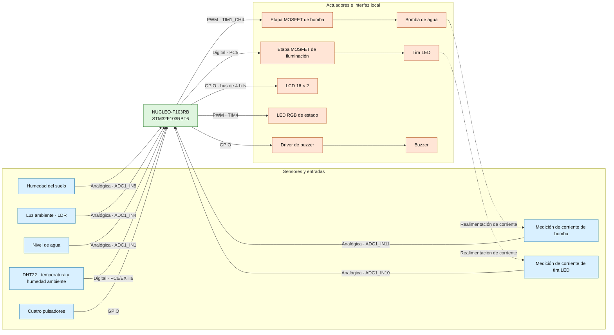
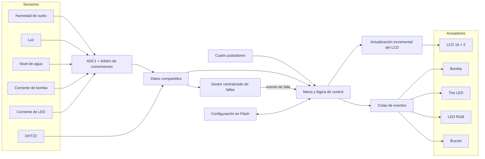
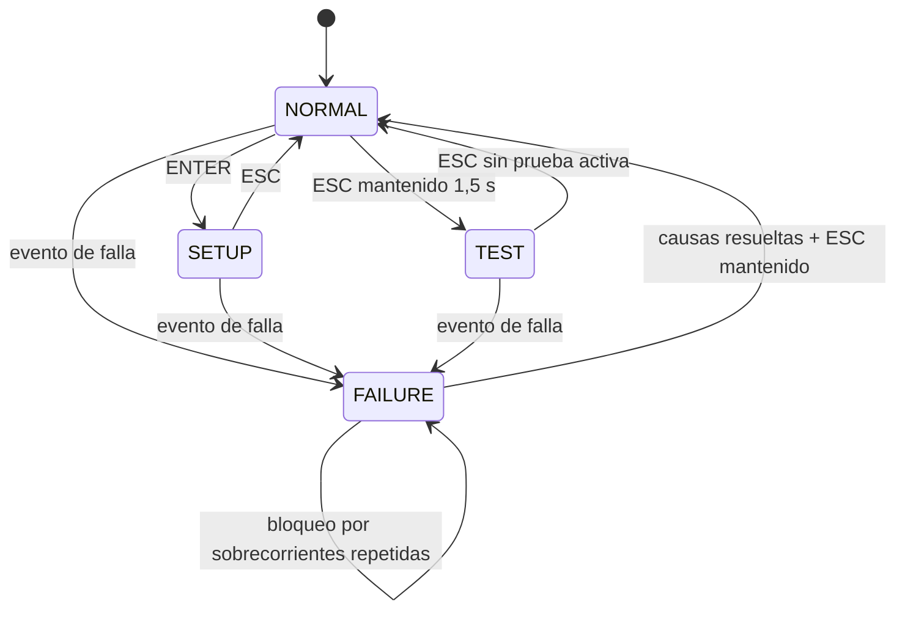

### Sistemas Embebidos

 

## Memoria del Trabajo Final

# Smartceta

### Sistema embebido para el cuidado automatizado de plantas

 

**Autores**

| Apellido y nombre | Padrón |
| --- | ---: |
| Carrizo, Ezequiel Ignacio | 105187 |
| Gonzalez Bigliardi, Iñaki | 107443 |
| Juncal, Franco Mariano | 106448 |

**Cuatrimestre de cursada:** segundo cuatrimestre de 2025

---

## Convención para completar esta versión

Este documento fue redactado con estructura y tono de entrega final a partir de los requisitos, el esquemático, la placa, el firmware y los artefactos de compilación presentes en el proyecto.

- <strong>🟢 Verde:</strong> valor numérico o resultado medido que debe introducirse después de realizar el ensayo indicado.
- <strong>🔵 Azul:</strong> anotación editorial, dato desconocido, decisión que debe confirmar el equipo o aspecto técnico que todavía requiere corrección o verificación.

Las marcas de color no deben permanecer sin resolver en la versión que se entregue.

---

## Resumen

El presente trabajo describe el diseño y la implementación de Smartceta, un sistema embebido destinado a asistir el cuidado de una planta doméstica. El equipo desarrollado adquiere la humedad del suelo, la intensidad de luz ambiente, el nivel de agua del depósito y la temperatura y humedad del aire. A partir de estas variables controla una bomba de riego y una tira de iluminación, y permite consultar las mediciones y modificar parámetros mediante una pantalla LCD y cuatro pulsadores.

La unidad de control se implementó sobre una placa NUCLEO-F103RB. El firmware se organizó como una aplicación *bare-metal* cooperativa, con tareas periódicas, máquinas de estados, intercambio de eventos y una estructura de datos compartida. También se incorporaron un LED RGB, un buzzer, medición de corriente en las etapas de potencia, un modo de prueba y almacenamiento de las configuraciones en la memoria Flash interna.

El prototipo permitió integrar en una única plataforma la adquisición de sensores, la actuación automática, la interfaz local y la persistencia de parámetros. El código fuente actual incluye un gestor de trece causas de falla y un modo de prueba con cuatro opciones de sensores y cuatro de actuadores. Estas funciones todavía requieren correcciones y validación experimental: entre otros puntos, deben resolverse la validez inicial de las mediciones, el desborde de colas, los enclavamientos de los actuadores y la calibración de los diagnósticos de corriente. La memoria presenta las decisiones de diseño, la implementación realizada, el protocolo de ensayos y la trazabilidad entre requisitos y resultados.

## Abstract

This report presents the design and implementation of Smartceta, an embedded system intended to assist with the care of a household plant. The system measures soil moisture, ambient light, water-tank level, air temperature, and relative humidity. These variables are used to control an irrigation pump and an artificial light source, while a local LCD and four push-buttons allow the user to inspect measurements and modify configuration parameters.

The control unit was implemented on an STM32 NUCLEO-F103RB board. Its firmware follows a cooperative bare-metal architecture based on periodic tasks, state machines, event queues, and shared application data. An RGB status LED, a buzzer, current-sensing circuits, a hardware test mode, and non-volatile configuration storage were also included.

The prototype integrates sensing, automatic actuation, local interaction, and parameter persistence in a single platform. The current source code includes a manager for thirteen fault conditions and a test mode with four sensor options and four actuator options. These functions still require corrections and experimental validation, particularly regarding initial sample validity, queue overflow handling, actuator interlocks, and current-sensing calibration. This report documents the design decisions, implementation, verification procedures, and requirement traceability of the system.

## Registro de versiones

| Revisión | Cambios realizados | Fecha |
| :---: | --- | :---: |
| 0.1 | Entrega de memoria técnica | --/--/2026 |

*Tabla 0.1: registro de versiones del documento.*

---

# Índice general

- [Capítulo 1: Introducción general](#capítulo-1-introducción-general)
  - [1.1 Necesidad, motivación y objetivo](#11-necesidad-motivación-y-objetivo)
  - [1.2 Alcance y limitaciones](#12-alcance-y-limitaciones)
  - [1.3 Descripción general del sistema](#13-descripción-general-del-sistema)
  - [1.4 Análisis de sistemas similares](#14-análisis-de-sistemas-similares)
  - [1.5 Justificación del enfoque técnico](#15-justificación-del-enfoque-técnico)
- [Capítulo 2: Introducción específica](#capítulo-2-introducción-específica)
  - [2.1 Requisitos](#21-requisitos)
  - [2.2 Casos de uso](#22-casos-de-uso)
  - [2.3 Descripción de los módulos principales](#23-descripción-de-los-módulos-principales)
- [Capítulo 3: Diseño e implementación](#capítulo-3-diseño-e-implementación)
  - [3.1 Arquitectura general](#31-arquitectura-general)
  - [3.2 Diseño de hardware](#32-diseño-de-hardware)
  - [3.3 Diseño de firmware](#33-diseño-de-firmware)
- [Capítulo 4: Ensayos y resultados](#capítulo-4-ensayos-y-resultados)
  - [4.1 Metodología general](#41-metodología-general)
  - [4.2 Pruebas funcionales del hardware](#42-pruebas-funcionales-del-hardware)
  - [4.3 Pruebas funcionales del firmware](#43-pruebas-funcionales-del-firmware)
  - [4.4 Pruebas de integración](#44-pruebas-de-integración)
  - [4.5 Consumo eléctrico](#45-consumo-eléctrico)
  - [4.6 Uso de memoria](#46-uso-de-memoria)
  - [4.7 Análisis temporal](#47-análisis-temporal)
  - [4.8 Gestión de bajo consumo](#48-gestión-de-bajo-consumo)
  - [4.9 Cumplimiento de requisitos](#49-cumplimiento-de-requisitos)
  - [4.10 Comparación final](#410-comparación-final)
  - [4.11 Documentación del desarrollo](#411-documentación-del-desarrollo)
- [Capítulo 5: Conclusiones](#capítulo-5-conclusiones)
  - [5.1 Resultados obtenidos](#51-resultados-obtenidos)
  - [5.2 Lecciones aprendidas](#52-lecciones-aprendidas)
  - [5.3 Trabajos necesarios antes del cierre](#53-trabajos-necesarios-antes-del-cierre)
  - [5.4 Posibles ampliaciones](#54-posibles-ampliaciones)
- [Capítulo 6: Uso de herramientas de inteligencia artificial](#capítulo-6-uso-de-herramientas-de-inteligencia-artificial)
- [Bibliografía y referencias](#bibliografía-y-referencias)
- [Anexos](#anexos)

---

# Capítulo 1: Introducción general

## 1.1 Necesidad, motivación y objetivo

El cuidado de una planta doméstica requiere observar de forma periódica el estado del sustrato, la disponibilidad de agua, la iluminación y las condiciones ambientales. Cuando estas tareas dependen por completo de la intervención manual pueden producirse riegos insuficientes o excesivos, falta de luz y períodos prolongados sin supervisión. El problema resulta especialmente relevante cuando el usuario no puede mantener una rutina constante.

Smartceta se propuso como una plataforma de asistencia local capaz de medir las variables principales, presentarlas de manera comprensible y actuar sobre el riego y la iluminación. El objetivo no fue eliminar toda participación humana, sino reducir la frecuencia de las acciones rutinarias y aportar información para que el usuario pudiera tomar mejores decisiones.

Los objetivos específicos del proyecto fueron:

1. Adquirir la humedad del suelo, la luz ambiente, el nivel de agua, la temperatura y la humedad relativa del aire.
2. Accionar una bomba de agua cuando el sustrato requiriera riego y hubiera agua disponible.
3. Encender una fuente de iluminación cuando la luz ambiente fuera insuficiente.
4. Mostrar las mediciones y el estado del sistema mediante una interfaz local.
5. Permitir la configuración de umbrales y conservarlos después de una desconexión.
6. Incorporar indicaciones visuales y sonoras, diagnóstico de corriente y un modo de prueba.
7. Mantener una arquitectura modular que admitiera ampliaciones posteriores.

## 1.2 Alcance y limitaciones

El alcance de la primera versión quedó definido de la siguiente manera.

**Funciones incluidas**

- Medición de humedad del suelo, luz, nivel de agua, temperatura y humedad ambiente.
- Lectura de dos señales destinadas al diagnóstico de corriente de bomba e iluminación.
- Riego mediante una bomba de corriente continua.
- Iluminación artificial mediante una tira LED de 5 V.
- Interfaz local con LCD de 16 × 2 caracteres y cuatro pulsadores.
- Señalización con LED RGB y buzzer.
- Configuración de umbrales y habilitación independiente del sonido y del LED de estado.
- Persistencia de configuraciones en la memoria Flash interna.
- Modo de prueba para sensores y actuadores.
- Código fuente para identificar y señalizar trece causas de falla y solicitar el apagado de las cargas; su recuperación y robustez todavía requieren corrección y validación.

**Funciones excluidas o postergadas**

- Alimentación autónoma mediante batería y panel solar.
- Conectividad Wi-Fi, Bluetooth o aplicación móvil.
- Gestión coordinada de varias macetas.
- Calefacción del sustrato o del ambiente.
- Medición de pH o nutrientes.
- Control remoto y almacenamiento histórico en la nube.

## 1.3 Descripción general del sistema

Smartceta se desarrolló como un sistema embebido destinado a supervisar las condiciones necesarias para el cuidado de una planta y actuar sobre ellas con una intervención mínima del usuario. La unidad central se implementó mediante una placa de desarrollo NUCLEO-F103RB, encargada de adquirir las mediciones, ejecutar la lógica de control y comandar tanto los actuadores como la interfaz local.

El sistema incorporó sensores para medir la humedad del suelo, la intensidad de luz ambiente, el nivel de agua disponible en el depósito y la temperatura y humedad del aire. También se incluyeron circuitos para medir la corriente consumida por la bomba y por la tira LED. Estas últimas mediciones se plantearon como información de diagnóstico para detectar condiciones de funcionamiento anormales en las etapas de potencia.

A partir de los valores adquiridos y de los parámetros configurados por el usuario, el sistema fue diseñado para determinar cuándo regar la planta y cuándo encender la iluminación artificial. El riego utiliza una bomba controlada por modulación por ancho de pulso, con una variación progresiva del valor medio de excitación durante el arranque y la detención. La iluminación se implementó mediante una tira LED con control de encendido y apagado. La condición de inicio del riego también considera el nivel disponible en el depósito. Las condiciones de parada y la histéresis de ambos controles conservan defectos que se detallan en las secciones 3.3.4 y 3.3.5.

La interacción con el usuario se concentró en una pantalla LCD de 16 × 2 caracteres y cuatro pulsadores: siguiente, anterior, aceptar y volver. En operación normal, la pantalla presentó de manera alternada las mediciones de los sensores. Desde el menú de configuración fue posible modificar los umbrales de humedad del suelo, luz y nivel de agua, además de habilitar o deshabilitar de manera independiente las señales sonoras y el LED de estado. Los cinco valores seleccionados se almacenaron en la memoria Flash del microcontrolador.

Como elementos de señalización se utilizaron un LED RGB y un buzzer. El color y el patrón del LED identifican el modo de operación, mientras que el buzzer informa acciones del sistema. Además de los modos normal y configuración, el código fuente incorpora un modo de prueba con cuatro lecturas de sensores y cuatro pruebas de actuadores. También contempla trece causas de falla y solicita el apagado de la bomba y de la tira LED al entrar en el modo correspondiente. La versión actual todavía debe corregirse y ensayarse antes de afirmar que la detección, la prioridad de eventos y la recuperación son seguras en todos los casos.

La figura 1.1 presenta la organización general de Smartceta.

*Figura 1.1: diagrama en bloques funcional de Smartceta.*

## 1.4 Análisis de sistemas similares

Durante la definición del alcance se consideraron dos equipos de riego doméstico. El sistema Beday integra una bomba, una interfaz local y modalidades de riego manual, temporizado o condicionado por humedad; algunas variantes se alimentan mediante batería y panel solar [14]. El HCT-355 funciona como programador conectado a una canilla, admite tres programas y dispone de detección de lluvia, riego manual e interfaz local [15]. Ambos resuelven parte del problema, pero no integran el mismo conjunto de sensores, actuación e interfaz propuesto para Smartceta.

| Sistema analizado | Variables consideradas | Riego | Iluminación | Interfaz | Diferencia principal respecto de Smartceta |
| --- | --- | --- | --- | --- | --- |
| Sistema de riego automático Beday | Humedad del sustrato en la variante consultada | Automático por temporización, humedad o mando manual | No incluida | Pantalla y teclado local | Puede incorporar alimentación solar, pero no documenta supervisión ambiental ni diagnóstico de corriente [14] |
| HCT-355 | Lluvia y programación horaria | Automático mediante tres programas | No incluida | Pantalla y botones | Requiere conexión a canilla y no decide el riego a partir de la humedad del suelo [15] |
| Smartceta | Humedad del suelo, luz, nivel de agua, temperatura, humedad ambiente y señales de corriente | Automático desde depósito | Encendido automático | LCD, cuatro botones, LED RGB y buzzer | Integra sensado, actuación, configuración y diagnóstico en una plataforma abierta |

*Tabla 1.1: comparación conceptual de los sistemas considerados.*

  
   
  <em>Figura 1.2: sistema de riego automático Beday utilizado como referencia [14].</em>

  
   
  <em>Figura 1.3: programador de riego HCT-355 utilizado como referencia [15].</em>

## 1.5 Justificación del enfoque técnico

El enfoque técnico se definió buscando un equilibrio entre funcionalidad, costo, disponibilidad de componentes y tiempo de implementación. Debido al alcance académico del trabajo, se priorizó la construcción de un prototipo autónomo en su operación, aunque alimentado desde una fuente externa, capaz de medir las variables principales asociadas al cuidado de una planta, actuar sobre ellas y ofrecer una interfaz local. Las funciones que requerían infraestructura adicional, como conectividad inalámbrica, batería, panel solar, control de múltiples macetas y análisis de pH, se dejaron fuera de la primera versión.

Como unidad de control se eligió la placa NUCLEO-F103RB. Su microcontrolador STM32F103RBT6 ofrece las entradas y salidas necesarias para conectar sensores, pantalla, pulsadores y actuadores. Los conversores analógico-digitales permiten adquirir las señales de humedad del suelo, luz, nivel de agua y corriente; los temporizadores se utilizan para la señal PWM de la bomba, el LED RGB y la temporización del DHT22; y la memoria Flash interna permite conservar los parámetros sin incorporar una memoria externa. El entorno STM32CubeIDE y la biblioteca HAL facilitaron la configuración de periféricos y la integración de módulos [4].

Los sensores se seleccionaron por disponibilidad, bajo costo y facilidad de conexión. Se empleó un sensor resistivo YL-69 para la humedad del suelo, una LDR para la luz, un módulo resistivo para el nivel de agua y un DHT22 para temperatura y humedad ambiente. Esta selección es apropiada para un prototipo, aunque requiere calibración y no ofrece la durabilidad ni la exactitud de sensores industriales.

El riego se implementó con una bomba de corriente continua y una etapa MOSFET de conmutación por el lado bajo. El PWM permite aplicar una rampa gradual del valor medio de excitación; su efecto sobre el pico instantáneo de corriente debe verificarse experimentalmente. La tira LED utiliza una segunda etapa MOSFET. Las dos ramas incluyen señales de medición destinadas al diagnóstico de corriente.

La interfaz local evita depender de un teléfono o de una red. El LCD, los pulsadores, el LED RGB y el buzzer proporcionan consulta, configuración y realimentación inmediata. La fuente externa de 5 V resulta más adecuada que una batería para alimentar de forma sostenida la placa, la bomba y la iluminación.

El firmware se organizó como un sistema *bare-metal* cooperativo con una base de tiempo de 1 ms. La separación en tareas aísla la adquisición, la interfaz y cada actuador; las colas de eventos desacoplan las órdenes; y una estructura compartida concentra las mediciones. Para utilizar un único ADC, las tareas analógicas coordinan su acceso y realizan conversiones por interrupción, sin espera activa.

En conjunto, las decisiones adoptadas concentran el esfuerzo en la adquisición de variables físicas, el control automático, la interacción local, la persistencia y el diagnóstico. La estructura modular permite ampliar el prototipo sin reemplazar por completo su arquitectura.

---

# Capítulo 2: Introducción específica

## 2.1 Requisitos

Los requisitos funcionales originales se conservaron con sus identificadores para mantener la trazabilidad con el diseño y los ensayos [5].

| Grupo | ID | Descripción |
| --- | :---: | --- |
| Indicadores | 0.1 | El sistema contará con una pantalla LCD para mostrar información al usuario. |
| Indicadores | 0.2 | El sistema contará con un LED indicador de estado. |
| Indicadores | 0.3 | El sistema contará con un buzzer para emitir señales sonoras. |
| Sensores | 1.1 | El sistema contará con un sensor de temperatura y humedad ambiente. |
| Sensores | 1.2 | El sistema contará con un sensor de luz ambiente. |
| Sensores | 1.3 | El sistema contará con un sensor de humedad del suelo. |
| Sensores | 1.4 | El sistema contará con un sensor de nivel de agua en el depósito. |
| Sensores | 1.5 | El sistema contará con un sensor de corriente para detectar fallas en la bomba. |
| Actuadores | 2.1 | El sistema contará con una bomba para regar la planta. |
| Actuadores | 2.2 | El sistema contará con una tira de luces LED para iluminar la planta. |
| Pulsadores | 3.0 | El sistema contará con pulsadores para interactuar con la aplicación. |
| Aplicación | 4.1 | La aplicación permitirá configurar el umbral de humedad del suelo. |
| Aplicación | 4.3 | La aplicación permitirá configurar la cantidad o intensidad de iluminación. |
| Aplicación | 4.4 | La aplicación permitirá activar o desactivar las alarmas sonoras y visuales. |
| Aplicación | 4.5 | La aplicación permitirá visualizar las lecturas de los sensores en tiempo real. |
| Aplicación | 4.6 | La aplicación permitirá ingresar a un modo de prueba de los componentes. |
| Aplicación | 4.7 | El sistema almacenará localmente valores y configuraciones básicas en memoria no volátil. |
| Alarmas | 5.1 | El sistema contará con alarmas sonoras y visuales para notificar fallas. |
| Alarmas | 5.2 | El sistema activará las alarmas cuando detecte un nivel de agua bajo. |
| Alarmas | 5.3 | El sistema activará las alarmas cuando detecte una falla en la bomba mediante la medición de corriente. |

*Tabla 2.1: requisitos funcionales de Smartceta.*

Como restricciones de diseño se adoptaron una alimentación externa de 5 V, operación local sin conectividad, ejecución *bare-metal* y utilización de la memoria y los periféricos internos del STM32F103RBT6.

## 2.2 Casos de uso

### 2.2.1 Operación normal

| Elemento | Definición |
| --- | --- |
| Disparador | El sistema termina la inicialización o regresa desde otro modo. |
| Precondiciones | Alimentación estable, sensores conectados y configuraciones válidas. |
| Flujo principal | El sistema actualiza las mediciones, las presenta en el LCD y evalúa periódicamente los umbrales. Si el suelo está seco y hay suficiente agua, ordena encender la bomba. Si la luz es inferior al umbral, enciende la tira LED. |
| Flujos alternativos | El usuario cambia la pantalla, entra a configuración o mantiene ESC para entrar al modo de prueba. Una lectura inválida debe originar una indicación de falla y una acción segura. |
| Poscondición | Los actuadores quedan en el estado determinado por las mediciones y la configuración. |

*Tabla 2.2: caso de uso de operación normal.*

### 2.2.2 Configuración de parámetros

| Elemento | Definición |
| --- | --- |
| Disparador | El usuario presiona ENTER en modo normal. |
| Precondiciones | El LCD y los pulsadores se encuentran operativos. |
| Flujo principal | El usuario recorre sonido, luz, nivel de agua, humedad del suelo y habilitación del LED de estado; selecciona un parámetro; modifica su valor; confirma con ENTER; y el firmware registra el cambio en Flash. |
| Flujos alternativos | ESC abandona la pantalla de edición sin escribir un nuevo registro en Flash o regresa al modo normal. En la versión actual no restaura en RAM el valor previo a la edición. |
| Poscondición | La configuración confirmada queda disponible en RAM y almacenada en memoria no volátil. |

*Tabla 2.3: caso de uso de configuración.*

### 2.2.3 Gestión de fallas

| Elemento | Definición |
| --- | --- |
| Disparador | `task_system_failure` detecta una o más de las trece causas contempladas: corriente anormal en bomba o tira LED, falla de sus etapas de potencia, temperatura fuera de rango, ausencia de respuesta del DHT22, nivel de agua bajo o lectura inválida de un sensor. |
| Precondiciones | Las tareas de adquisición y el monitoreo de fallas se encuentran activos. |
| Flujo principal | El gestor registra las causas activas y notifica al menú. Al ingresar en modo de falla, el firmware solicita apagar la bomba y la tira LED, presenta en el LCD el código y nombre de la causa y activa las indicaciones visuales o sonoras que estén habilitadas. El usuario puede recorrer las causas y el sistema realiza autoavance. |
| Recuperación prevista | Una pulsación mantenida de ESC solicita borrar las fallas y retornar al modo normal cuando el gestor las considera recuperables. Dos detecciones separadas de sobrecorriente en una misma carga bloquean la recuperación normal. La implementación actual no vuelve a comprobar todas las causas y requiere corrección antes de validar este flujo. |

*Tabla 2.4: caso de uso de gestión de fallas.*

### 2.2.4 Prueba de componentes

| Elemento | Definición |
| --- | --- |
| Disparador | El usuario mantiene presionado ESC durante 1,5 s en modo normal. |
| Precondiciones | El prototipo está conectado y el depósito contiene agua antes de probar la bomba. |
| Flujo principal | El usuario recorre los componentes con siguiente/anterior, inicia una prueba con ENTER y la detiene con ESC. Un segundo ESC regresa al modo normal. |
| Componentes implementados | Nivel de agua, luz, humedad de suelo, DHT22, LED RGB, buzzer, bomba y tira LED. |
| Poscondición prevista | Las pruebas de sensores finalizan sin modificar salidas y toda prueba de actuador debe terminar con todas las cargas apagadas. La versión actual sólo solicita apagar la salida seleccionada en ese momento. |

*Tabla 2.5: caso de uso del modo de prueba.*

## 2.3 Descripción de los módulos principales

### 2.3.1 Unidad de control

La placa NUCLEO-F103RB incorpora un microcontrolador STM32F103RBT6 basado en Arm Cortex-M3, con 128 KiB de memoria Flash, 20 KiB de SRAM, conversores ADC de 12 bits, temporizadores y GPIO suficientes para el prototipo [1]. La placa también proporciona la interfaz ST-LINK para programación y depuración [2].

### 2.3.2 Sensores

| Variable | Elemento empleado | Interfaz | Alimentación | Uso en el sistema |
| --- | --- | --- | --- | --- |
| Humedad del suelo | YL-69 | Analógica | 3,3 V | Determina la necesidad de riego |
| Luz ambiente | Módulo Duaitek LIGHT-SENSOR con LDR y LM393 | Analógica AO; salida digital DO no utilizada | 3,3–5 VCC; 3,3 V en Smartceta | Determina el encendido de la tira LED |
| Nivel de agua | Módulo resistivo KY-059 | Analógica | 3–5 VCC; 3,3 V en Smartceta | Habilita el riego y detecta nivel bajo |
| Temperatura y humedad del aire | DHT22 | Digital de un hilo propietario | 3,3 V | Información ambiental [3] |
| Corriente de bomba | Resistencia de medición y limitación por Zener | Analógica hacia ADC de 3,3 V | Componente pasivo | Diagnóstico de la etapa de riego |
| Corriente de iluminación | Resistencia de medición y limitación por Zener | Analógica hacia ADC de 3,3 V | Componente pasivo | Diagnóstico de la etapa de iluminación |

*Tabla 2.6: sensores y señales adquiridas.*

El módulo de luz Duaitek LIGHT-SENSOR incorpora un fotoresistor LDR, un comparador LM393 y un potenciómetro para ajustar el umbral de su salida digital. También dispone de una salida analógica relacionada de forma no lineal con la iluminación, que Smartceta convierte en un porcentaje relativo. Su alimentación admitida es de 3,3 a 5 VCC y la placa mide aproximadamente 30 × 14 mm [11].

El KY-059 detecta la presencia y el nivel relativo de agua mediante pistas conductoras expuestas. Posee una salida analógica, admite una alimentación de 3 a 5 VCC y presenta un área sensible aproximada de 40 × 16 mm sobre una placa de 65 × 20 × 8 mm. La publicación no especifica exactitud ni un rango de nivel en centímetros o litros, por lo que la conversión a porcentaje corresponde a una calibración propia del depósito [10].

### 2.3.3 Actuadores y etapas de potencia

La bomba utilizada es una Duaitek WATER-PUMP-120LH, especificada para 3–6 VCC y un caudal máximo publicado de 120 L/h; en Smartceta se alimenta con 5 V [12]. La publicación comercial de la iluminación identifica un set de dos tiras flexibles de 2 m con LED 5050 y alimentación mediante portapilas [13]. Deben verificarse sobre la unidad instalada su tensión nominal, densidad de LED, protección ambiental, longitud efectivamente utilizada y corriente. En el prototipo, el segmento instalado se alimenta desde la línea de 5 V mediante su etapa de potencia.

Cada carga se conecta mediante una etapa MOSFET de canal N IRLZ44 en configuración de conmutación por el lado bajo. La bomba recibe PWM desde TIM1, mientras que la tira LED se controla como una salida digital. Un transistor MPSA42 maneja el buzzer y tres canales PWM controlan los colores del LED RGB.

<strong>🟢 VALOR A COMPLETAR:</strong> corriente nominal y corriente de arranque medidas sobre la bomba instalada: ___ mA y ___ mA.

<strong>🟢 VALOR A COMPLETAR:</strong> potencia o corriente medida de la tira o del segmento efectivamente instalado: ___ W o ___ mA.

### 2.3.4 Interfaz local

La interfaz está formada por un LCD alfanumérico de 16 × 2 caracteres conectado en modo de cuatro bits y cuatro pulsadores activos en nivel bajo: siguiente, anterior, ENTER y ESC. Un LED RGB identifica los modos y acciones principales; el buzzer genera un pulso, dos pulsos, una indicación continua o un patrón intermitente según el evento recibido.

### 2.3.5 Alimentación

Una fuente externa de 5 V alimenta la placa y las cargas. Los sensores y niveles lógicos utilizan 3,3 V provistos por la plataforma. La arquitectura no incorpora batería ni gestión de carga.

---

# Capítulo 3: Diseño e implementación

## 3.1 Arquitectura general

La arquitectura separa adquisición, supervisión, decisión, interfaz y actuación. Las tareas de sensores actualizan una estructura común; `task_system_failure` evalúa las condiciones anormales; `task_menu` consulta los datos, administra los modos y produce eventos; `task_display` transfiere al LCD el contenido solicitado; y las tareas de actuadores consumen colas independientes. Los pulsadores generan eventos de usuario. Las configuraciones se escriben en la última página de la Flash, aunque esa página todavía no está reservada en el *linker script* [7].

*Figura 3.1: arquitectura funcional presente en el código fuente.*

El firmware no utiliza un sistema operativo. SysTick aporta la base de 1 ms y un despachador invoca catorce funciones de actualización en orden fijo. Entre ellas se encuentran una tarea específica que actualiza el LCD de forma incremental y una tarea que centraliza la detección y el registro de fallas. Cada módulo mantiene su propio estado y, cuando corresponde, limita internamente su frecuencia de adquisición o actuación.

## 3.2 Diseño de hardware

### 3.2.1 Unidad de control y periféricos

El reloj del sistema se obtiene del oscilador interno HSI dividido por dos y multiplicado por dieciséis mediante el PLL. El núcleo y APB2 operan a 64 MHz, APB1 a 32 MHz y el ADC recibe 64 MHz/6, aproximadamente 10,67 MHz.

| Periférico | Configuración relevante | Función |
| --- | --- | --- |
| ADC1 | 12 bits; canales seleccionados en tiempo de ejecución; muestreo de 239,5 ciclos | Cinco entradas analógicas |
| TIM1 CH4 | Prescaler 0; período 65535 | PWM de la bomba, aproximadamente 976,6 Hz |
| TIM2 | Prescaler 63; período 65535 | Base de 1 µs para decodificar el DHT22 |
| TIM4 CH1/CH3/CH4 | Prescaler 0; período 100 | PWM azul, verde y rojo del LED de estado |
| SysTick | 1 ms | Base temporal del planificador |
| EXTI6, atendida por EXTI9_5 | Flancos ascendentes y descendentes durante la adquisición | Captura de la trama DHT22 |
| USART2 | 115200 bit/s | Configurada, sin uso funcional en el código fuente actual |

*Tabla 3.1: periféricos principales del STM32.*

### 3.2.2 Entradas analógicas y calibración

Las cinco señales analógicas comparten ADC1. Antes de cada conversión la tarea solicitante configura el canal y registra su propiedad en el router de callbacks. La conversión se inicia por interrupción; al finalizar, el valor se entrega únicamente a la tarea propietaria y se libera el recurso. Cada tarea posee además un tiempo de espera de 10 ms para evitar que una conversión perdida bloquee indefinidamente el módulo.

La humedad del suelo se calcula entre dos extremos incluidos en el firmware: 4095 para suelo seco y 1700 para suelo húmedo. El nivel de agua utiliza 0 para depósito vacío y 2200 para el nivel adoptado como lleno. La luz se escala entre 4095 para oscuridad y 0 para máxima iluminación. Todos los porcentajes se limitan al intervalo 0–100 %.

Las señales de corriente se convierten actualmente a porcentajes suponiendo 0 cuentas como ausencia de corriente y 4095 cuentas como escala completa. Estos extremos son provisionales y no representan una calibración eléctrica.

### 3.2.3 Sensor DHT22

La lectura del DHT22 se implementó sin espera activa prolongada. La línea de datos está conectada a PC6 y utiliza EXTI6, atendida mediante el vector compartido `EXTI9_5_IRQn`. La tarea inicia la comunicación cada 2000 ms, mantiene la línea en nivel bajo durante 2 ms y luego habilita la interrupción por ambos flancos. TIM2 mide la duración de los pulsos con resolución de 1 µs. Los pulsos altos mayores que 50 µs se interpretan como unos lógicos. La trama recibida se valida mediante su suma de comprobación antes de actualizar los datos compartidos.

### 3.2.4 Control de la bomba

La bomba se conecta mediante un IRLZ44 en conmutación por el lado bajo y se comanda desde PA11/TIM1_CH4. Su rango publicado es de 3–6 VCC y su caudal máximo es de 120 L/h. El firmware modifica el valor de comparación entre 0 y 65000 en pasos de 100 cada 1 ms. La transición completa dura aproximadamente 650 ms tanto al encender como al apagar.

El sensado de corriente utiliza una resistencia de medición y una entrada limitada por un diodo Zener, de acuerdo con el esquemático [6]. El objetivo es detectar consumo excesivo y, tras una calibración adecuada, distinguir una bomba desconectada o bloqueada.

### 3.2.5 Control de iluminación e indicadores

La tira instalada utiliza LED 5050 y se conecta a una segunda etapa IRLZ44 gobernada por PC5 como salida digital. Por lo tanto, el código fuente ofrece encendido y apagado, no regulación de intensidad. La corriente se adquiere por PC0/ADC1_IN10. La publicación comercial no permite confirmar todas las características eléctricas y ambientales del segmento usado; hasta verificarlas, debe instalarse fuera del alcance de salpicaduras y condensación.

El LED RGB utiliza TIM4: PB6 para azul, PB8 para verde y PB9 para rojo. El firmware define verde fijo para modo normal, azul con parpadeo lento para configuración, rojo con parpadeo rápido para falla y violeta fijo para prueba. Durante el riego emplea un patrón adicional asociado al evento de agua.

### 3.2.6 Interfaz de usuario

El LCD se conectó en modo de cuatro bits para reducir la cantidad de GPIO. `task_display` utiliza un doble búfer y actualiza el LCD de forma incremental: en cada invocación realiza una operación de posicionamiento o escribe un carácter, evitando concentrar la actualización completa de las dos filas en un único ciclo del planificador. Los pulsadores poseen *pull-up* y son activos en nivel bajo. La tarea de botones aplica un antirrebote temporal de 50 ms y reconoce una pulsación mantenida de ESC a los 1500 ms.

El buzzer se acciona mediante un transistor MPSA42. Los patrones implementados incluyen un pulso de 80 ms, dos pulsos de 80 ms separados por 80 ms, sonido continuo y alternancia de 300 ms encendido/300 ms apagado.

### 3.2.7 Alimentación y protecciones

La entrada externa de 5 V alimenta la NUCLEO y las cargas. Las entradas analógicas y los periféricos de señal operan a 3,3 V. El esquemático incorpora resistencias de medición y limitación por Zener en las entradas de corriente. No muestra resistencias serie ni *pull-down* en las compuertas de Q1 y Q2, ni un diodo de rueda libre en paralelo con la bomba; estos elementos deben resolverse antes de considerar cerrada la protección de las etapas de potencia.

### 3.2.8 Esquemático, PCB y montaje

La documentación eléctrica se encuentra en los siguientes archivos:

- [Esquemático completo](../hardware/TDSE-TF/TDSE-TF.pdf).
- [Capa de cobre](../hardware/TDSE-TF/TDSE-TF-B_Cu.pdf).
- [Plano de fabricación](../hardware/TDSE-TF/TDSE-TF-F_Fab.pdf).
- [Asignación de pines de la NUCLEO](../hardware/TDSE-TF/NucleoF103RB-pinout.jpg).
- [Fuente del esquemático](../hardware/TDSE-TF/TDSE-TF.kicad_sch).
- [Fuente de la PCB](../hardware/TDSE-TF/TDSE-TF.kicad_pcb).

### 3.2.9 Pinout del sistema

| Función | Pin STM32 | Periférico o modo |
| --- | --- | --- |
| Nivel de agua | PA1 | ADC1_IN1 |
| Luz ambiente | PA4 | ADC1_IN4 |
| Humedad del suelo | PB0 | ADC1_IN8 |
| Corriente de LED | PC0 | ADC1_IN10 |
| Corriente de bomba | PC1 | ADC1_IN11 |
| DHT22 | PC6 | GPIO/EXTI6 |
| PWM de bomba | PA11 | TIM1_CH4 |
| Tira LED | PC5 | Salida digital |
| LED RGB azul | PB6 | TIM4_CH1 |
| LED RGB verde | PB8 | TIM4_CH3 |
| LED RGB rojo | PB9 | TIM4_CH4 |
| Buzzer | PB13 | Salida digital |
| ESC | PB1 | Entrada con *pull-up* |
| Siguiente | PB2 | Entrada con *pull-up* |
| Anterior | PB14 | Entrada con *pull-up* |
| ENTER | PB15 | Entrada con *pull-up* |
| LCD RS | PA0 | Salida digital |
| LCD E | PA8 | Salida digital |
| LCD D4 | PB10 | Salida digital |
| LCD D5 | PB4 | Salida digital |
| LCD D6 | PB5 | Salida digital |
| LCD D7 | PA10 | Salida digital |
| USART2 TX/RX | PA2/PA3 | AF push-pull / entrada |

*Tabla 3.2: asignación de pines implementada.*

### 3.2.10 Lista de materiales

| Cantidad | Elemento | Valor o modelo | Observaciones |
| ---: | --- | --- | --- |
| 1 | Placa de desarrollo | NUCLEO-F103RB | Unidad de control |
| 1 | Sensor de humedad de suelo | YL-69 | Sensor resistivo |
| 1 | Sensor ambiental | DHT22 | Temperatura y humedad |
| 1 | Sensor de luz | Duaitek LIGHT-SENSOR | LDR + LM393; 3,3–5 VCC; salida AO utilizada |
| 1 | Sensor de nivel | KY-059 | Resistivo; salida analógica; 3–5 VCC |
| 1 | Bomba sumergible | Duaitek WATER-PUMP-120LH | 3–6 VCC; caudal máximo publicado de 120 L/h |
| 1 | Segmento de tira LED | Veoquiero 5050, unidad tomada de un set ×2 | Verificar longitud instalada, tensión, densidad, protección y corriente |
| 1 | LCD | 16 × 2 | Interfaz paralela de cuatro bits |
| 4 | Pulsadores | Normalmente abiertos | Con *pull-up* |
| 1 | LED RGB | Cátodo común | Indicador de estado |
| 1 | Buzzer | Buzzer activo | Aviso sonoro |
| 2 | MOSFET canal N | IRLZ44 | Bomba y tira LED |
| 1 | Transistor NPN | MPSA42 | Driver de buzzer |
| 2 | Diodos Zener | 1N4727A | Protección de entradas |
| 4 | Resistencias | 330 Ω, 1/4 W | LED RGB y señalización |
| 1 | Resistencia | 5,1 kΩ, 1/4 W | Según esquemático |
| 1 | Resistencia de potencia R1 | 10 Ω, 2 W | Medición de corriente; confirmar valor montado de 10,14 Ω |
| 1 | Resistencia R2 | 🔵 Valor todavía definido como TBD en el esquemático | Medición de corriente; determinar antes del cierre |
| 1 | Resistencia R8 | 3,3 kΩ, 1/4 W | Base del transistor del buzzer |
| 1 | Potenciómetro RV1 | 10 kΩ | Contraste del LCD |
| 2 | Tiras de pines hembra dobles | 🔵 Confirmar cantidad de posiciones | Conexión de la NUCLEO |
| — | Conectores de sensores y cargas | 🔵 Confirmar tipo y cantidad montados | Incluir en la BOM final |
| 1 | PCB | Diseño TDSE-TF | Prototipo |

*Tabla 3.3: lista de materiales consolidada a partir del diseño disponible.*

## 3.3 Diseño de firmware

### 3.3.1 Arquitectura de ejecución

Después de inicializar HAL, relojes y periféricos, `app_init()` inicializa las catorce tareas. `HAL_SYSTICK_Callback()` incrementa un contador cada 1 ms y `app_update()` consume los ticks pendientes. Por cada tick se ejecutan, siempre en el mismo orden, todas las funciones `update`. El orden es fijo, pero el cumplimiento temporal sólo puede considerarse determinista si el WCET del ciclo, las interrupciones, el registro por semihosting y la recuperación de ticks atrasados permanecen dentro del presupuesto de 1 ms.

El contador de ciclos DWT mide el tiempo de cada tarea y conserva su máximo observado. Esta instrumentación permite obtener el WCET experimental sin modificar la secuencia funcional.

### 3.3.2 Tareas y periodicidades

| Tarea | Responsabilidad | Activación efectiva |
| --- | --- | --- |
| `task_button` | Antirrebote y eventos de cuatro pulsadores | Evaluación cada 1 ms |
| `task_display` | Copia el contenido solicitado a un doble búfer y actualiza el LCD de manera incremental | Cada 1 ms cuando existe contenido pendiente |
| `task_humidity` | Humedad de suelo | Solicitud de muestra cada 50 ms |
| `task_light` | Luz ambiente | Solicitud de muestra cada 50 ms |
| `task_water_level` | Nivel de agua | Solicitud de muestra cada 50 ms |
| `task_pump_current` | Corriente de bomba | Solicitud de muestra cada 50 ms |
| `task_led_current` | Corriente de iluminación | Solicitud de muestra cada 50 ms |
| `task_dht22` | Temperatura y humedad del aire | Inicio de trama cada 2000 ms |
| `task_state_led` | Color y parpadeo del LED RGB | Cada 1 ms y por eventos |
| `task_buzzer` | Patrones sonoros | Cada 1 ms y por eventos |
| `task_pump` | Estado y rampa PWM | Cada 1 ms y por eventos |
| `task_led_strip` | Encendido de iluminación | Cada 1 ms y por eventos |
| `task_system_failure` | Supervisa trece causas y mantiene el conjunto de fallas activas | Evaluación cada 1 ms |
| `task_menu` | Modos, configuración, presentación de datos y decisiones de control | Cada 1 ms; autoavance 5 s; luz 10 s; riego 20 s |

*Tabla 3.4: tareas principales del firmware.*

### 3.3.3 Adquisición y datos compartidos

Las tareas analógicas implementan pequeñas máquinas de estados: espera del período, solicitud del ADC, espera de conversión, procesamiento y publicación. El router de callbacks evita que una tarea consuma la conversión iniciada por otra. Los valores procesados se almacenan en `shared_data`, junto con el modo activo y los estados relevantes.

El DHT22 utiliza una máquina separada con estados de inicio, captura, decodificación, validación y error. La adquisición por flancos evita bloquear el lazo principal durante toda la trama.

### 3.3.4 Control de riego

La decisión se evalúa cada 20 s y también mientras la variable `pump_on` está activa. El arranque requiere que el nivel de agua sea mayor o igual que el mínimo configurado y que la humedad del suelo sea menor que la consigna. La tarea de bomba aplica la rampa PWM de 650 ms. La intención de diseño es detener el riego cuando la humedad alcance la consigna más una banda de 10 puntos porcentuales.

<strong>🔵 DEFECTO PENDIENTE:</strong> en <code>task_menu.c</code> la comparación de parada utiliza <code>humidity_percent &lt; consigna + 10</code>; debe utilizar una condición de humedad suficientemente alta. Con el código actual, la bomba puede apagarse casi inmediatamente después de finalizar la rampa. El control automático no debe declararse aprobado hasta corregirlo, limitar el tiempo máximo de riego y superar INT-03.

### 3.3.5 Control de iluminación

Cada 10 s la tarea de menú ordena primero apagar la tira y luego vuelve a encenderla si la luz medida es menor o igual que el umbral configurado. Esta secuencia puede introducir una interrupción breve aun cuando la iluminación deba continuar encendida.

<strong>🔵 DEFECTO PENDIENTE:</strong> la comparación con <code>umbral + 10</code> no implementa una histéresis real porque antes se pierde el estado anterior. Debe conservarse el estado de la tira, encender sólo por debajo del umbral inferior y apagar sólo por encima del superior; después debe aprobarse INT-02 sin oscilación ni parpadeo.

### 3.3.6 Modos de operación

*Figura 3.2: modos contemplados por el código fuente.*

Los cuatro modos poseen lógica de ejecución en el código fuente. En `NORMAL` se presentan las mediciones y se evalúan los controles automáticos; `SETUP` permite editar y guardar cinco configuraciones; y `TEST` ofrece cuatro lecturas de sensores y cuatro pruebas de actuadores. Ante un evento de falla, el menú ingresa en `FAILURE`, solicita apagar la bomba y la tira LED y muestra las causas activas. La transición no representa por sí sola una validación funcional: las colas, los enclavamientos y la recuperación conservan defectos pendientes.

### 3.3.7 Interfaz de usuario

En modo normal el LCD recorre cinco pantallas: humedad del suelo, humedad ambiente, temperatura ambiente, luz y nivel de agua. El cambio es manual con siguiente/anterior o automático cada 5 s. ENTER abre el menú de configuración y ESC mantenido abre el modo de prueba.

Los valores configurables y sus límites se muestran en la tabla 3.5.

| Parámetro | Valor inicial del firmware | Intervalo |
| --- | ---: | ---: |
| Sonidos | 1, habilitados | 0–1 |
| Umbral de luz | 50 % | 0–100 % |
| Nivel mínimo de agua | 40 % | 15–100 % |
| Humedad deseada del suelo | 70 % | 0–100 % |
| LED de estado | 1, habilitado | 0–1 |

*Tabla 3.5: cinco configuraciones predeterminadas.*

<strong>🔵 DEFECTO PENDIENTE:</strong> aunque el mínimo declarado para el nivel de agua es 15 %, al incrementar el valor desde 100 % el editor actual lo lleva a 0 %. Además, ESC evita grabar en Flash pero no restaura el valor anterior en RAM. Ambos comportamientos deben corregirse antes de aprobar FW-03.

### 3.3.8 Alarmas y recuperación

`task_system_failure` evalúa trece causas agrupadas en corriente anormal de la bomba, corriente anormal de la tira LED, fallas de sus etapas de potencia, temperatura fuera del intervalo admitido, ausencia de respuesta del DHT22, nivel de agua bajo y lecturas consideradas inválidas en los sensores analógicos. Cada causa activa se conserva en una tabla interna para que la interfaz pueda mostrarla de manera individual. En la implementación actual, sin embargo, un valor de 0 % se usa como diagnóstico de error para agua, luz y humedad de suelo, aunque puede representar una condición física válida; tampoco existe una marca general de muestra válida o antigüedad.

La definición de algunos disparos no es única. `task_water_level` emite un evento al bajar de un umbral fijo de 10 %, mientras que `task_system_failure` compara contra el nivel configurable —40 % de manera predeterminada—. De forma similar, `task_led_current` produce un evento genérico por encima de 80 %, pero el gestor registra la sobrecorriente de iluminación por encima de 90 %. Estos pares de umbrales deben unificarse y asociarse a una única causa trazable.

Mientras una condición permanece verdadera, la tarea publica `EV_SYS_FAILURE` en cada invocación de 1 ms. El menú cambia al modo de falla y, al ingresar, solicita apagar la bomba y la tira LED. La tira conmuta de inmediato, pero la bomba completa una rampa descendente de aproximadamente 650 ms; debe definirse si esa latencia es aceptable para cada causa o si se requiere una vía de corte inmediato. El LCD muestra el código y el nombre de la causa; los pulsadores siguiente y anterior permiten recorrer las causas y existe un autoavance temporizado. El buzzer y el LED RGB se activan sólo si sus configuraciones respectivas están habilitadas. La repetición del evento, unida a colas sin control de capacidad, puede ocultar eventos o pulsaciones y debe corregirse.

La recuperación se habilita cuando `task_system_failure_can_restore()` determina que las causas activas volvieron a una condición admisible. El usuario debe mantener ESC para borrar las fallas y regresar a operación normal. Dos detecciones independientes de sobrecorriente en la bomba o en la tira LED bloquean esta recuperación y mantienen el sistema en la pantalla de bloqueo. Las fallas de carga abierta no se vuelven a comprobar antes de permitir la recuperación y el umbral de nivel usa una desigualdad que puede volver imposible restaurar cuando la configuración vale 100 %.

<strong>🔵 ANOTACIÓN:</strong> la implementación debe corregirse y después aprobarse mediante FW-10, FW-12, INT-04 e INT-05. Deben verificarse las trece causas, el arranque sin muestras válidas, la rampa de la bomba sin falsos diagnósticos, la prioridad del evento de falla, la latencia efectiva de apagado y el comportamiento de recuperación y bloqueo.

### 3.3.9 Persistencia de configuraciones

Las configuraciones se almacenan desde la dirección `0x0801FC00`, correspondiente a la última página de 1 KiB de la Flash. Cada registro ocupa cuatro bytes: índice y valor, ambos de 16 bits. Al iniciar, el firmware reconstruye el último valor válido de cada parámetro. Cuando se completan 256 registros, borra la página y escribe un estado consolidado.

La escritura normal programa el valor antes que el índice, pero la inicialización y la compactación lo hacen en el orden inverso. Además, no se comprueban todos los retornos de HAL, no existe CRC o versión de formato y la página no está excluida de los 128 KiB que el enlazador asigna al programa. Los valores iniciales son 1, 50, 40, 70 y 1 para sonido, luz, nivel de agua, humedad y LED de estado, respectivamente.

### 3.3.10 Diagnóstico

La aplicación conserva el máximo observado de cada tarea mediante DWT y contiene mensajes de registro. No conserva todavía el máximo del ciclo completo. El *logger* utiliza semihosting y deshabilita interrupciones durante cada fragmento transmitido, por lo que las mediciones temporales finales deben realizarse sin ese mecanismo o cuantificando su interferencia.

---

# Capítulo 4: Ensayos y resultados

## 4.1 Metodología general

La verificación se dividió en cuatro niveles:

1. Ensayos eléctricos de alimentación, entradas y salidas.
2. Pruebas funcionales de cada módulo de firmware.
3. Escenarios de integración de extremo a extremo.
4. Caracterización de consumo, memoria y tiempo de ejecución.

El instrumental utilizado fue:

- Multímetro digital Uni-t Ut890c.
- Fuente de laboratorio.
- Fuente de 5 V, 🟢 corriente nominal: ___ mA.
- Osciloscopio Hantek DSO2D10.
- Depurador ST-LINK y STM32CubeIDE.
- Recipiente graduado, sustrato seco y húmedo y una referencia ambiental.

<strong>🔵 ANOTACIÓN:</strong> asociar a cada fila un enlace a una fotografía, captura de osciloscopio o archivo de datos.

## 4.2 Pruebas funcionales del hardware

| ID | Ensayo | Procedimiento y criterio de aceptación | Resultado registrado |
| :---: | --- | --- | --- |
| HW-01 | Alimentación de 5 V y 3,3 V | Medir ambas líneas en reposo y con máxima carga. No deben salir de la tolerancia admitida por los componentes. | 🟢 Fuente sin carga: 5,1 V; corriente nominal: ___ mA. Faltan 3,3 V y mediciones bajo carga. |
| HW-02 | LCD | Encender, recorrer todas las pantallas y comprobar legibilidad y ausencia de caracteres corruptos. | 🔵 El equipo informa funcionamiento esperado; registrar recorrido, duración y evidencia. |
| HW-03 | Pulsadores | Realizar al menos 20 pulsaciones breves por tecla y cinco pulsaciones mantenidas de ESC. No deben observarse eventos dobles ni pérdidas. | 🔵 El equipo informa funcionamiento esperado; documentar cantidad de aciertos y pérdidas por tecla. |
| HW-04 | Humedad del suelo | Medir en aire, sustrato seco, humedad intermedia y sustrato saturado. La respuesta debe ser monotónica y repetible. | 🟢 ADC y porcentaje en cada punto: ___ |
| HW-05 | Luz | Medir en oscuridad, ambiente e iluminación intensa. La indicación debe cubrir el intervalo útil sin saturación prematura. | 🟢 ADC y porcentaje en cada punto: ___ |
| HW-06 | Nivel de agua | Registrar vacío y varios niveles conocidos. La lectura debe ser monotónica y habilitar el riego sólo sobre el mínimo. | 🟢 ADC, altura y volumen por punto: ___ |
| HW-07 | DHT22 | Comparar diez lecturas con un instrumento de referencia en régimen estable. | 🟢 Error máximo: ___ °C y ___ %HR |
| HW-08 | Bomba y PWM | Observar PA11, verificar frecuencia, rampa y caudal; controlar temperatura del MOSFET. | 🟢 f = ___ Hz; rampa = ___ ms; caudal = ___ mL/min; Tmáx = ___ °C |
| HW-09 | Tira LED | Accionar PC5, medir corriente y verificar apagado completo. | 🟢 tira LED Encendida = ___ mA; tira LED apagada = ___ mA |
| HW-10 | Medición de corriente | Aplicar cero, carga nominal y condición límite a ambos canales. El error debe permanecer dentro del margen definido. | 🟢 Offset, ganancia, error y umbral de cada canal: ___ |
| HW-11 | LED RGB y buzzer | Solicitar todos los patrones y comprobar color, frecuencia visual y sonido. | 🔵 El equipo informa funcionamiento esperado; registrar cada patrón y su evidencia. |
| HW-12 | Protección inductiva | Incorporar el dispositivo de rueda libre, medir el transitorio de apagado y verificar que no exceda los límites del MOSFET ni del sistema. | 🔵 El esquemático actual no muestra protección de rueda libre. 🟢 Dispositivo: ___; pico VDS = ___ V. |

*Tabla 4.1: protocolo de pruebas funcionales del hardware.*

<strong>🔵 ANOTACIÓN:</strong> una vez disponible el video, asociarlo como evidencia de estas funciones y de las pruebas de integración, indicando la marca temporal correspondiente a cada ensayo.

## 4.3 Pruebas funcionales del firmware

| ID | Función | Procedimiento | Criterio | Resultado |
| :---: | --- | --- | --- | --- |
| FW-01 | Inicio | Arrancar con Flash vacía y con Flash previamente configurada. | Carga valores iniciales en el primer caso, conserva los últimos valores en el segundo y no dispara fallas antes de contar con muestras válidas. | 🔵 Pendiente: el código inicializa mediciones en cero y puede entrar en falla antes de la primera muestra. |
| FW-02 | Navegación normal | Recorrer manualmente las cinco variables y esperar el autoavance. | Orden correcto, texto válido y autoavance cercano a 5 s. | 🔵 Funcionamiento informado; falta adjuntar registro temporizado y evidencia. |
| FW-03 | Configuración | Modificar los cinco parámetros, cancelar una edición y confirmar otra. | Respeta límites, ESC restaura el valor anterior y ENTER guarda. | 🔵 No aprobado: nivel de agua puede pasar de 100 % a 0 % y ESC no restaura el valor en RAM. |
| FW-04 | Persistencia | Guardar valores, desconectar durante 30 s y volver a alimentar. Repetir después de múltiples escrituras y durante una compactación controlada. | Los valores recuperados coinciden con los confirmados y un corte no produce registros incompletos. | 🔵 Funcionamiento básico informado; faltan reserva de página, comprobación de errores e integridad ante cortes. |
| FW-05 | Antirrebote | Inyectar pulsaciones rápidas y observar los eventos. | Un evento por pulsación válida; ESC mantenido se detecta una vez. | 🔵 Funcionamiento informado; falta adjuntar conteos y registro de eventos. |
| FW-06 | Arbitraje ADC | Mantener las cinco tareas analógicas activas y registrar conversiones y *timeouts*. | Ningún resultado se asigna al canal incorrecto, no hay bloqueo y todo error invalida o marca como antigua la muestra previa. | 🔵 Falta evidencia; los errores actuales conservan el valor previo sin indicador de validez o antigüedad. |
| FW-07 | Validación DHT22 | Probar lectura normal, sensor ausente y trama con checksum incorrecto. | Publica sólo tramas válidas, conserva el signo y la resolución acordada y señala los errores definidos. | 🔵 Falta evidencia; la publicación actual trunca las décimas y el formato de temperatura negativa es incorrecto. |
| FW-08 | Rampa de bomba | Enviar ON, OFF y órdenes durante una rampa. | *Duty* limitado, transición monotónica, estado final coherente y ausencia de falsos diagnósticos de corriente. | 🔵 Falta evidencia; <code>pump_on</code> no representa la rampa y puede provocar un diagnóstico falso del driver. |
| FW-09 | Patrones de salida | Solicitar todos los eventos de LED y buzzer. | La salida coincide con la tabla de patrones y una orden nueva reemplaza la anterior de forma definida. | 🔵 Funcionamiento informado; falta adjuntar el registro de todos los patrones. |
| FW-10 | Capacidad de colas | Generar ráfagas superiores a la capacidad normal. | No se corrompe memoria; el desborde queda registrado y el sistema pasa a una condición definida. | 🔵 No aprobado: las colas no comprueban capacidad y el gestor puede publicar fallas repetidamente. |
| FW-11 | Modo de prueba | Probar cada una de las ocho opciones. | Cada opción ejecuta, informa y detiene la prueba de forma segura. | 🔵 Las ocho opciones están implementadas; falta documentar su ejecución y validar enclavamientos y salida segura. |
| FW-12 | Estado de falla | Inyectar cada una de las trece causas de falla. | Identifica la causa, apaga cargas peligrosas, avisa y recupera de forma controlada. | 🔵 El gestor está implementado; falta registrar el resultado de cada causa y validar apagado, recuperación y bloqueo. |

*Tabla 4.2: pruebas funcionales del firmware.*

## 4.4 Pruebas de integración

| ID | Escenario de extremo a extremo | Resultado esperado | Evidencia final |
| :---: | --- | --- | --- |
| INT-01 | Visualización ambiental | Las cinco variables se actualizan y muestran con unidad válida. | 🟢 Foto/video y rango observado: ___ |
| INT-02 | Iluminación automática | La tira enciende bajo el umbral y apaga sobre el umbral superior sin oscilación. | 🟢 Umbrales y tiempos medidos: ___ |
| INT-03 | Riego automático | Con suelo seco y agua suficiente, la bomba riega hasta alcanzar la condición de parada. | 🟢 Humedad inicial/final, tiempo y volumen: ___ |
| INT-04 | Depósito con nivel bajo | La bomba no arranca o se detiene; se indica la causa. | 🟢 Nivel de disparo y respuesta: ___ |
| INT-05 | Falla de bomba | Una corriente anormal detiene la bomba y genera aviso. | 🟢 Corriente de disparo y tiempo de reacción: ___ |
| INT-06 | Configuración y reinicio | Los valores confirmados se mantienen después de quitar alimentación. | 🟢 Ciclos superados: ___/___ |
| INT-07 | Modo de prueba | El usuario prueba individualmente todos los sensores y actuadores sin crear una condición peligrosa. | 🟢 Opciones aprobadas: ___/8 |
| INT-08 | Operación prolongada | El sistema opera sin bloqueo, corrupción de pantalla ni activación espuria. | 🟢 Duración: ___ h; fallas: ___ |

*Tabla 4.3: escenarios de integración y evidencia final.*

<strong>🔵 ANOTACIÓN:</strong> grabar un video continuo que muestre encendido, lectura de sensores, menú, persistencia, iluminación, riego, modo de prueba y al menos una falla controlada. Agregar su enlace permanente en la sección 4.11.

## 4.5 Consumo eléctrico

La medición debe realizarse sobre la entrada de 5 V, no únicamente sobre la NUCLEO, porque la bomba y la tira LED dominan el consumo. Para cada estado se registran tensión y corriente después de alcanzar régimen. La potencia de entrada se calcula como:

$$
P = V \cdot I
\tag{4.1}
$$

| Estado | Tensión de entrada | Corriente | Potencia | Observaciones |
| --- | ---: | ---: | ---: | --- |
| Sistema en reposo | 🟢 ___ V | 🟢 ___ mA | 🟢 ___ W | LCD y sensores activos |
| Sólo tira LED | 🟢 ___ V | 🟢 ___ mA | 🟢 ___ W | Medir iluminación final |
| Bomba en régimen | 🟢 ___ V | 🟢 ___ mA | 🟢 ___ W | Después de la rampa |
| Arranque de bomba | 🟢 ___ V mín. | 🟢 ___ mA pico | 🟢 ___ W pico | Captura con osciloscopio |
| Bomba + tira LED | 🟢 ___ V | 🟢 ___ mA | 🟢 ___ W | Peor caso sostenido |
| Modo de falla seguro | 🟢 ___ V | 🟢 ___ mA | 🟢 ___ W | LED y buzzer de alarma |

*Tabla 4.4: consumo del prototipo.*

La fuente final debe soportar el peor caso sostenido y el pico de arranque con margen. Se recomienda documentar el criterio:

$$
I_{\text{fuente}} \geq I_{\text{pico medido}} \cdot M
\tag{4.2}
$$

<strong>🟢 VALOR A COMPLETAR:</strong> margen adoptado \(M =\) ___ y corriente mínima resultante de la fuente = ___ A.

## 4.6 Uso de memoria

El STM32F103RBT6 dispone físicamente de 128 KiB de Flash y 20 KiB de SRAM. Si se reserva la última página de 1 KiB para configuraciones, la aplicación debe enlazarse sobre 130 048 B. En el artefacto histórico existente se observaron 36 140 B ocupados en la imagen de Flash y una reserva de RAM de 3952 B. Esta última cifra incluye `.data`, `.bss`, 512 B de *heap*, 1024 B de *stack* y alineación.

| Recurso | Capacidad aplicable | Artefacto histórico | Valor de la compilación final |
| --- | ---: | ---: | ---: |
| Flash física | 131 072 B | 36 140 B (27,6 % de la Flash física) | 🟢 ___ B (___ %) |
| Flash destinada a la aplicación | 130 048 B, después de reservar 1 KiB | 36 140 B (27,8 %) | 🟢 ___ B (___ %) |
| SRAM reservada | 20 480 B | 3952 B (19,3 %) | 🟢 ___ B (___ %) |
| Margen de Flash para la aplicación | 130 048 B | 93 908 B | 🟢 ___ B |
| Margen de SRAM | 20 480 B | 16 528 B | 🟢 ___ B |

*Tabla 4.5: utilización de memoria.*

<strong>🔵 ANOTACIÓN:</strong> estos números no deben presentarse como resultados finales: el ELF y el MAP disponibles son anteriores a módulos y cambios del código fuente actual, y los manifiestos de <code>Debug</code> no incluyen todos los módulos documentados. Reservar primero la página de configuración, realizar un <em>clean build</em> y reemplazar la columna verde con el reporte de la compilación entregada.

El tamaño observado deja margen amplio, pero la última página de Flash se usa para configuraciones y debe excluirse formalmente del espacio enlazable.

## 4.7 Análisis temporal

### 4.7.1 Metodología

El firmware instrumenta cada tarea mediante el contador DWT, pero no actualiza un máximo equivalente para el ciclo completo. Para obtener valores representativos se debe:

1. Reiniciar los máximos.
2. Ejecutar todos los modos y provocar cada rama relevante.
3. Capturar varias tramas DHT22, conversiones ADC, escrituras Flash, rampas y eventos simultáneos.
4. Registrar el máximo por tarea e instrumentar externamente o agregar al firmware el máximo del ciclo completo.
5. Repetir en la configuración de compilación que se entregará y sin pausas del depurador.

Como verificación independiente puede conmutarse un GPIO al inicio y final de `app_update()` y observarlo con un osciloscopio.

### 4.7.2 WCET experimental

| Tarea | Período de invocación | WCET medido | Utilización \(C_i/T_i\) |
| --- | ---: | ---: | ---: |
| Botones | 1000 µs | 🟢 ___ µs | 🟢 ___ % |
| Display | 1000 µs | 🟢 ___ µs | 🟢 ___ % |
| Humedad de suelo | 1000 µs | 🟢 ___ µs | 🟢 ___ % |
| Luz | 1000 µs | 🟢 ___ µs | 🟢 ___ % |
| Nivel de agua | 1000 µs | 🟢 ___ µs | 🟢 ___ % |
| Corriente de bomba | 1000 µs | 🟢 ___ µs | 🟢 ___ % |
| Corriente de LED | 1000 µs | 🟢 ___ µs | 🟢 ___ % |
| DHT22 | 1000 µs | 🟢 ___ µs | 🟢 ___ % |
| LED RGB | 1000 µs | 🟢 ___ µs | 🟢 ___ % |
| Buzzer | 1000 µs | 🟢 ___ µs | 🟢 ___ % |
| Bomba | 1000 µs | 🟢 ___ µs | 🟢 ___ % |
| Tira LED | 1000 µs | 🟢 ___ µs | 🟢 ___ % |
| Gestor de fallas | 1000 µs | 🟢 ___ µs | 🟢 ___ % |
| Menú | 1000 µs | 🟢 ___ µs | 🟢 ___ % |
| **Ciclo completo** | **1000 µs** | <strong>🟢 ___ µs</strong> | <strong>🟢 ___ %</strong> |

*Tabla 4.6: WCET experimental de las tareas.*

Aunque varias tareas sólo realizan una adquisición cada 50 ms o 2000 ms, su función de actualización es invocada cada 1 ms. Por ello, la cota conservadora de utilización del ciclo cooperativo se calcula como:

$$
U = \frac{\sum_{i=1}^{14} C_i}{1000\ \mu s}
\tag{4.3}
$$

<strong>🟢 VALOR A COMPLETAR:</strong> \(U =\) ___ %, holgura temporal = ___ µs y máximo atraso de ticks observado = ___.

El criterio mínimo es que el WCET del ciclo completo sea menor que 1000 µs. Para conservar margen ante interrupciones y variabilidad se debe definir un límite de proyecto más exigente.

<strong>🟢 VALOR A COMPLETAR:</strong> límite de utilización adoptado por el equipo = ___ %.

## 4.8 Gestión de bajo consumo

El firmware no ingresa al microcontrolador en modos *sleep*, *stop* o *standby*. El lazo principal consulta continuamente el contador de ticks y la placa permanece alimentada desde una fuente externa. Dado que la bomba y la tira LED representan cargas considerablemente mayores que el núcleo, el bajo consumo no fue una prioridad de esta versión.

La decisión es coherente con el alcance, pero no debe confundirse con una implementación energéticamente optimizada. Una ampliación con batería o panel solar requeriría apagar periféricos, reducir la frecuencia de reloj, dormir entre eventos, disminuir el consumo del LCD y diseñar una estrategia específica para la iluminación y la bomba.

## 4.9 Cumplimiento de requisitos

La tabla 4.7 relaciona cada requisito con la evidencia disponible en el diseño y con la acción necesaria para completar su verificación experimental.

| ID | Requisito resumido | Evidencia de diseño | Acción para el cierre |
| :---: | --- | --- | --- |
| 0.1 | Pantalla LCD | Driver, pinout y menú de cinco pantallas | 🟢 Adjuntar prueba HW-02/FW-02 |
| 0.2 | LED de estado | TIM4 y tabla de colores/patrones | 🟢 Adjuntar prueba HW-11 |
| 0.3 | Buzzer | Driver y patrones temporales | 🟢 Adjuntar prueba HW-11 |
| 1.1 | Temperatura y humedad ambiente | Tarea DHT22 con captura y checksum | 🟢 Informar exactitud de HW-07 |
| 1.2 | Luz ambiente | PA4/ADC1_IN4 y conversión porcentual | 🟢 Incorporar calibración HW-05 |
| 1.3 | Humedad del suelo | PB0/ADC1_IN8 y conversión porcentual | 🟢 Incorporar calibración HW-04 |
| 1.4 | Nivel de agua | PA1/ADC1_IN1, porcentaje y umbral | 🟢 Incorporar calibración HW-06 |
| 1.5 | Diagnóstico de corriente de bomba | PC1/ADC1_IN11; detección de sobrecorriente, circuito abierto y conducción sin orden | Calibrar los umbrales y validar diagnóstico, apagado y recuperación |
| 2.1 | Bomba de riego | MOSFET, PWM y rampa | Corregir la condición de parada, agregar tiempo máximo y enclavamiento, incorporar rueda libre y aprobar INT-03 |
| 2.2 | Tira LED | MOSFET y control digital | Corregir la lógica de histéresis y adjuntar HW-09 e INT-02 |
| 3.0 | Pulsadores | Cuatro entradas, antirrebote y pulsación mantenida | 🟢 Adjuntar HW-03/FW-05 |
| 4.1 | Configurar humedad | Menú 0–100 % y almacenamiento | Corregir la cancelación en RAM y adjuntar FW-03/FW-04 |
| 4.3 | Configurar iluminación | Umbral de luz 0–100 % | No regula cantidad/intensidad; redefinir requisito o implementar PWM |
| 4.4 | Activar/desactivar alarmas | Opciones persistentes e independientes para sonido y LED de estado | Validar ambas configuraciones durante FW-03 y FW-12 |
| 4.5 | Visualizar sensores | Cinco pantallas con avance manual/automático | No muestra corrientes ni diagnósticos; aclarar alcance y adjuntar INT-01 |
| 4.6 | Modo de prueba | Cuatro pruebas de sensores y cuatro de actuadores | Validar las ocho opciones, asegurar la salida correcta y agregar el enclavamiento de agua para la bomba |
| 4.7 | Persistencia local | Registro secuencial de cinco configuraciones en la última página Flash | Reservar la página, validar rangos e integridad ante cortes y aprobar FW-04 |
| 5.1 | Alarmas sonoras y visuales de falla | Gestor de trece causas, LCD, LED RGB, buzzer y recuperación | Calibrar los disparos y aprobar FW-12 |
| 5.2 | Alarma por nivel de agua bajo | Causa identificada y solicitud de apagado al ingresar en falla | Validar umbral, indicación, bloqueo de riego y recuperación mediante INT-04 |
| 5.3 | Alarma por falla de bomba | Detección de sobrecorriente, circuito abierto y conducción indebida | Calibrar los umbrales y validar diagnóstico, apagado y recuperación mediante INT-05 |

*Tabla 4.7: trazabilidad de requisitos y acciones para el cierre.*

<strong>🔵 ANOTACIÓN:</strong> después de corregir el firmware y ejecutar los ensayos, citar la evidencia exacta para cada requisito. No considerar verificado un requisito sólo porque el componente está presente.

## 4.10 Comparación final

| Característica | Beday | HCT-355 | Smartceta |
| --- | --- | --- | --- |
| Criterio de riego | Temporización, humedad o manual | Horario programado | Humedad de suelo + disponibilidad de agua |
| Depósito propio | Externo | No, conexión a canilla | Sí |
| Medición ambiental | No documentada | No | Temperatura y humedad relativa |
| Medición de luz | Sí | No | Sí |
| Iluminación artificial | No | No | Tira LED automática |
| Diagnóstico eléctrico | No documentado | No documentado | Dos entradas de corriente, calibración pendiente |
| Interfaz | Pantalla y botones | Pantalla y botones | LCD, cuatro botones, LED RGB y buzzer |
| Alimentación | Solar y batería | Pilas AA | Fuente externa de 5 V |
| Modificabilidad | Producto cerrado | Producto cerrado | Hardware y firmware del prototipo disponibles |

*Tabla 4.8: comparación final de características.*

Smartceta ofrece una integración más amplia para experimentación y permite modificar tanto el control como la interfaz. En cambio, los productos comerciales presentan un montaje y una alimentación más resueltos. La comparación no pretende demostrar superioridad comercial: el prototipo carece todavía de gabinete, certificación, caracterización de vida útil y cierre completo de seguridad.

<strong>🔵 ANOTACIÓN:</strong> respaldar todas las columnas comerciales con las fuentes solicitadas en 1.4 y agregar fecha de consulta. Si se dispone de precios, expresarlos con moneda y fecha, no como valores permanentes.

## 4.11 Documentación del desarrollo

| Elemento | Ubicación | Estado observado |
| --- | --- | --- |
| Requisitos y casos de uso | [`REQUISITOS.md`](../REQUISITOS.md) | Disponible |
| Proyecto STM32CubeIDE | [`tdse-tf_3-03/`](../tdse-tf_3-03/) | Disponible |
| Código de aplicación | [`tdse-tf_3-03/app/`](../tdse-tf_3-03/app/) | Disponible |
| Configuración de periféricos | [`tdse-tf_3-03/Core/`](../tdse-tf_3-03/Core/) | Disponible |
| Esquemático y PCB | [`hardware/TDSE-TF/`](../hardware/TDSE-TF/) | Fuentes KiCad y PDF disponibles; revisiones 2/6 pendientes de reconciliar y reglas pendientes de cierre |
| Lista de materiales | [`hardware/BOM.txt`](../hardware/BOM.txt) | Incompleta |
| Memoria técnica | [`Memoria Tecnica/Memoria Tecnica.md`](Memoria%20Tecnica.md) | Versión integral para revisión |
| Repositorio remoto | 🔵 Agregar URL y etiqueta o *commit* de entrega | Pendiente |
| Evidencias de ensayo | 🔵 Agregar carpeta y enlaces | Pendiente |
| Video final | 🔵 Agregar enlace permanente | Pendiente |

*Tabla 4.9: documentación asociada al desarrollo.*

Para garantizar la reproducibilidad, la entrega debe identificar una revisión inmutable del código y conservar junto a ella el binario, el archivo `.map`, las evidencias de ensayo, las fuentes de las figuras y la versión final de esta memoria.

---

# Capítulo 5: Conclusiones

## 5.1 Resultados obtenidos

El proyecto permitió diseñar una plataforma embebida que reúne las funciones principales necesarias para asistir el cuidado de una planta. Sobre una única NUCLEO-F103RB se integraron cinco entradas analógicas, un sensor digital temporizado por flancos, una pantalla, cuatro pulsadores, dos cargas de potencia y dos indicadores locales.

La arquitectura cooperativa y modular separó las responsabilidades de adquisición, interfaz y actuación. El arbitraje del ADC organiza el uso concurrente de un único conversor sin introducir esperas activas prolongadas, mientras que las colas de eventos desacoplan la lógica de menú de las salidas. Estas decisiones deben validarse con registros de conversión, *timeouts*, antigüedad de muestras y desborde de colas. La persistencia en Flash conserva consignas en las pruebas informadas, pero aún requiere reservar la página y robustecer su integridad.

El código fuente disponible incorpora una reacción ante trece causas de falla y un modo de prueba con cuatro sensores y cuatro actuadores. Sin embargo, la presencia de estas funciones no equivale por sí sola a una validación de seguridad: todavía deben corregirse la validez inicial de las mediciones, la publicación repetitiva de fallas, el control de capacidad de las colas, la recuperación incompleta y los enclavamientos del modo de prueba. Los canales de corriente requieren calibración; el control automático de bomba e iluminación también conserva defectos funcionales. En consecuencia, Smartceta constituye un prototipo integrado y extensible, pero no debe presentarse como un sistema de riego autónomo seguro hasta resolver y ensayar esos puntos.

<strong>🟢 VALOR A COMPLETAR:</strong> después de la campaña final, resumir aquí tres resultados cuantitativos: error máximo de sensado = ___; consumo máximo = ___ W; utilización de CPU = ___ %.

## 5.2 Lecciones aprendidas

La integración de sensores de distinta naturaleza mostró la importancia de separar adquisición, conversión y publicación de datos. El esquema de propiedad del ADC evita interferencias entre canales y puede reutilizarse en otros proyectos con recursos compartidos.

El desarrollo de las etapas de potencia puso de manifiesto que la existencia de una orden de software no garantiza una acción segura. El control de una bomba requiere considerar corriente de arranque, protección inductiva, disponibilidad de agua, tiempo máximo de funcionamiento y una vía de apagado ante fallas.

La interfaz basada en eventos simplificó la incorporación de modos y patrones de señalización, pero también evidenció la necesidad de diseñar explícitamente el tratamiento de colas llenas y de eventos prioritarios. Una falla crítica no debe competir en igualdad de condiciones con una pulsación de usuario.

Por último, la trazabilidad entre requisito, implementación y ensayo permitió detectar diferencias que no resultaban evidentes al observar módulos aislados, como la interpretación de “intensidad de iluminación”, la necesidad de validar de forma independiente las alarmas sonoras y visuales y los riesgos de navegación y apagado dentro del modo de prueba.

## 5.3 Trabajos necesarios antes del cierre

Las siguientes acciones son necesarias para transformar la versión actual en una entrega técnicamente cerrada:

1. Corregir y ensayar la condición de apagado de la bomba.
2. Corregir la histéresis del control de iluminación y verificar que no existan interrupciones periódicas.
3. Validar y robustecer `SYS_FAILURE`, incluyendo validez y antigüedad de muestras, las trece causas, el apagado seguro, la señalización, la recuperación, el bloqueo y la prioridad de sus eventos.
4. Calibrar humedad del suelo, nivel, luz y ambos canales de corriente.
5. Ensayar las ocho opciones del modo de prueba y corregir los enclavamientos y la salida segura de los actuadores.
6. Incorporar y verificar la protección de rueda libre de la bomba y las resistencias requeridas en las compuertas.
7. Ejecutar la calibración interna del ADC y hacer visibles los errores de adquisición.
8. Reservar la página de configuración en el *linker script* y robustecer la integridad de sus registros.
9. Definir la política de desborde de colas, impedir la publicación repetitiva de una misma falla y establecer prioridad de eventos.
10. Corregir la conservación y presentación de la resolución y el signo del DHT22.
11. Ejecutar la matriz de ensayos, un *clean build* y la caracterización temporal y de consumo.
12. Consolidar la BOM, las fotografías, las fuentes comerciales y el video.

## 5.4 Posibles ampliaciones

Una vez cerrada la base funcional, el sistema podría incorporar sensores capacitivos de suelo, regulación PWM de la iluminación, registro histórico, reloj de tiempo real, conectividad inalámbrica, control de varias macetas, gabinete resistente a humedad y alimentación mediante batería y energía solar. Estas ampliaciones deben abordarse después de resolver la seguridad y la repetibilidad del prototipo actual.

---

# Capítulo 6: Uso de herramientas de inteligencia artificial

Durante la preparación de esta versión de la memoria se utilizó una herramienta de inteligencia artificial para analizar la estructura de dos informes de referencia [8], [9], recorrer los archivos del proyecto, proponer una organización documental y redactar una primera versión integral. Las afirmaciones técnicas se contrastaron con `REQUISITOS.md`, el esquemático, la asignación de pines, el código fuente y el archivo de mapa disponible.

La herramienta no realizó ensayos físicos ni tuvo acceso a observaciones que no estuvieran registradas en el proyecto. Por ese motivo, todo valor experimental quedó identificado en verde y toda duda o decisión pendiente quedó identificada en azul. La responsabilidad de verificar, corregir y aprobar el contenido final corresponde al equipo autor.

| Participante | Herramienta | Uso | Verificación humana requerida |
| --- | --- | --- | --- |
| Juncal, Franco Mariano | ChatGPT/Codex  | Análisis, generación y diagnóstico de código; generación de documentos | Revisión de la lógica del código, ensayo de implementaciones y corrección humana de las redacciones |
| 🔵 Integrante responsable | 🔵 Herramienta y versión | 🔵 Indicar otros usos: código, esquemático, pruebas, imágenes, etc. | 🔵 Explicar cómo se validó el resultado |

*Tabla 6.1: uso declarado de herramientas de inteligencia artificial.*

<strong>🔵 ANOTACIÓN:</strong> adaptar esta declaración a las reglas de la cátedra e incluir los usos reales de todos los integrantes. No atribuir a la herramienta mediciones, decisiones o verificaciones que realizó el equipo.

---

# Bibliografía y referencias

[1] STMicroelectronics, [*DS5319 — STM32F103x8/STM32F103xB: medium-density performance line Arm-based 32-bit MCU*](https://www.st.com/en/microcontrollers-microprocessors/stm32f103/documentation.html), hoja de datos, consultada el 25/07/2026.

[2] STMicroelectronics, [*UM1724 — STM32 Nucleo-64 boards (MB1136)*](https://www.st.com/resource/en/user_manual/dm00105823.pdf), revisión 14, manual de usuario, consultado el 25/07/2026.

[3] Aosong Electronics, [*AM2302/DHT22 temperature and humidity sensor*](https://asairsensors.com/product/am2302-dht22-temperature-and-humidity-sensor/), documentación del fabricante, consultada el 25/07/2026.

[4] STMicroelectronics, [*UM1850 — Description of STM32F1 HAL and low-layer drivers*](https://www.st.com/en/embedded-software/stm32cubef1.html), versión 3.0, 04/02/2020.

[5] Equipo Smartceta, [*Requisitos y modos de uso*](../REQUISITOS.md), segundo cuatrimestre de 2025.

[6] Equipo Smartceta, [*Esquemático eléctrico TDSE-TF*](../hardware/TDSE-TF/TDSE-TF.pdf).

[7] Equipo Smartceta, [*Proyecto de firmware STM32CubeIDE*](../tdse-tf_3-03/).

[8] Embebidos-Fran-Marcos-Nacho, [*Memoria técnica del proyecto tdse-tf_1-2*](https://github.com/Embebidos-Fran-Marcos-Nacho/tdse-tf_1-2/tree/Memoria-final-y-video), consultada el 25/07/2026 como referencia de estructura documental.

[9] M. G. Villafañe, [*Memoria del Trabajo Final — Smartlock*](https://github.com/mgvillafane/SE_TP_Smartlock/tree/main), consultada el 25/07/2026 como referencia de estructura documental.

[10] Mercado Libre Argentina, [*Sensor de detección de agua de lluvia KY-059 Arduino*](https://www.mercadolibre.com.ar/sensor-de-deteccion-de-agua-de-lluvia-ky059-arduino/up/MLAU128801427?pdp_filters=item_id:MLA1605215490), ficha comercial consultada el 23/07/2026.

[11] Mercado Libre Argentina, [*Módulo sensor de luz con LDR fotoresistor compatible con Arduino*](https://www.mercadolibre.com.ar/modulo-sensor-de-luz-con-ldr-fotoresistor-compatible-con-arduino/p/MLA32487827?pdp_filters=item_id:MLA1666016788), modelo Duaitek LIGHT-SENSOR, ficha comercial consultada el 23/07/2026.

[12] Mercado Libre Argentina, [*Bomba sumergible Duaitek WATER-PUMP-120LH, 3–6 V*](https://www.mercadolibre.com.ar/bomba-sumergible-duaitek-water-pump-120lh-3v-6v-120lh-para-acuario/p/MLA39116120?pdp_filters=item_id:MLA1456284509), ficha comercial consultada el 23/07/2026.

[13] Mercado Libre Argentina, [*Tira LED Veoquiero 5050 de 2 m, set ×2*](https://www.mercadolibre.com.ar/tira-led-2m-set-x2-a-pila-flexible-interior-5050-veoquiero/p/MLA67484374?pdp_filters=item_id:MLA3131487374), ficha comercial consultada el 23/07/2026.

[14] Mercado Libre México, [*Sistema automático de riego por goteo solar Beday para 15 plantas*](https://www.mercadolibre.com.mx/sistema-automatico-de-riego-por-goteo-solar-beday-15-plants/p/MLM2079479850), ficha comercial consultada el 25/07/2026.

[15] Eshine, [*HCT-355 Water Timer — instruction manual*](https://eshine-t.com/wp-content/uploads/2025/09/Manual-HCT-355-EN.pdf), manual de usuario consultado el 25/07/2026.

---

**Fin de la memoria técnica**
