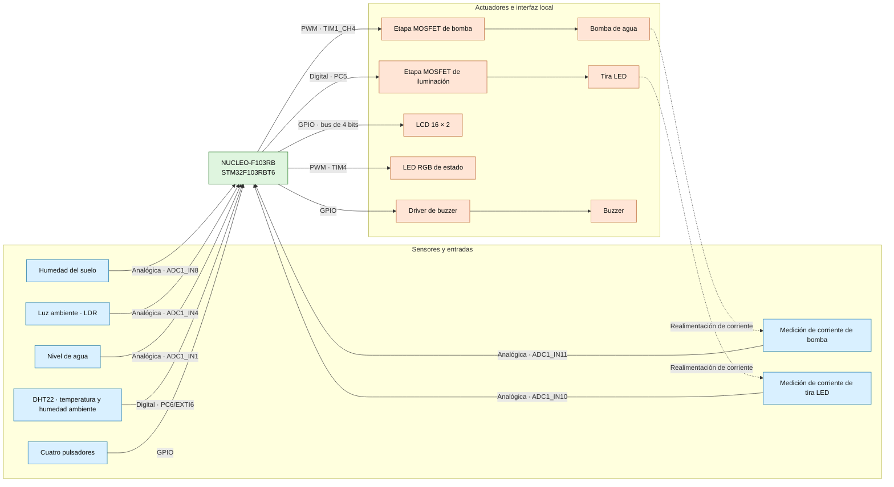
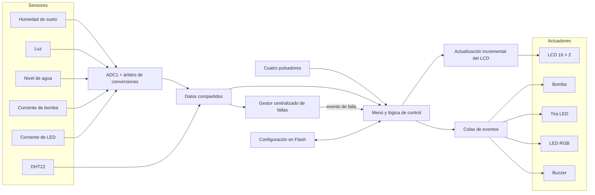
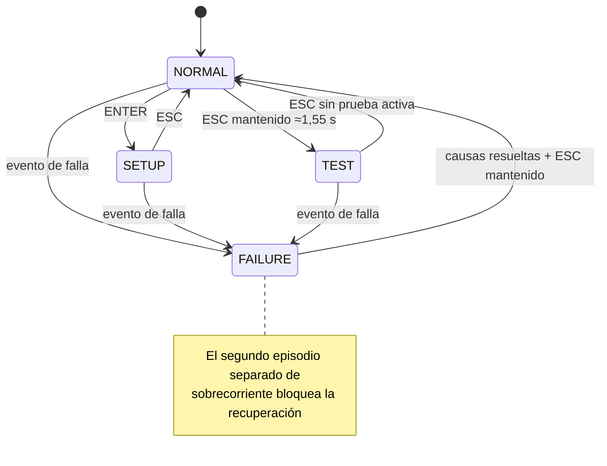

### Sistemas Embebidos

 

## Memoria del Trabajo Final

# Smartceta

### Sistema embebido para el cuidado automatizado de plantas

 

**Autores**

| Apellido y nombre | Padrón |
| --- | ---: |
| Carrizo, Ezequiel Ignacio | 105187 |
| Gonzalez Bigliardi, Iñaki | 107443 |
| Juncal, Franco Mariano | 106448 |

**Cuatrimestre de cursada:** segundo cuatrimestre de 2025

---

## Convención para completar esta versión

Este documento fue redactado con estructura y tono de entrega final a partir de los requisitos, el esquemático, la placa, el firmware y los artefactos de compilación presentes en el proyecto.

- <strong>🟢 Verde:</strong> valor numérico o resultado medido que debe introducirse después de realizar el ensayo indicado.
- <strong>🔵 Azul:</strong> anotación editorial, dato desconocido, decisión que debe confirmar el equipo o aspecto técnico que todavía requiere corrección o verificación.

Las marcas de color no deben permanecer sin resolver en la versión que se entregue.

---

## Resumen

El presente trabajo describe el diseño y la implementación de Smartceta, un sistema embebido destinado a asistir el cuidado de una planta doméstica. El equipo desarrollado adquiere la humedad del suelo, la intensidad de luz ambiente, el nivel de agua del depósito y la temperatura y humedad del aire. A partir de estas variables controla una bomba de riego y una tira de iluminación, y permite consultar las mediciones y modificar parámetros mediante una pantalla LCD y cuatro pulsadores.

La unidad de control se implementó sobre una placa NUCLEO-F103RB. El firmware se organizó como una aplicación *bare-metal* cooperativa, con tareas periódicas, máquinas de estados, intercambio de eventos y una estructura de datos compartida. También se incorporaron un LED RGB, un buzzer, medición de corriente en las etapas de potencia, un modo de prueba y almacenamiento de las configuraciones en la memoria Flash interna.

El prototipo permitió integrar en una única plataforma la adquisición de sensores, la actuación automática, la interfaz local y la persistencia de parámetros. La última revisión del firmware corrigió la condición de parada del riego, incorporó una histéresis basada en el estado de la iluminación, convirtió a miliamperes las dos señales de corriente y evitó la publicación repetitiva de una misma causa de falla. Una compilación limpia de la configuración `Release`, que incluyó las catorce tareas, finalizó sin errores ni advertencias. Permanecen pendientes la validación experimental y varios puntos de seguridad: el estado de reposo de la bomba conserva aproximadamente 15 % de *duty* en vez de un apagado eléctrico, no existe un tiempo máximo de riego, las colas no poseen una política completa de desborde y prioridad, el modo de prueba conserva riesgos de enclavamiento y la página de configuración aún no está reservada en el *linker script*. La memoria presenta las decisiones de diseño, la implementación realizada, el protocolo de ensayos y la trazabilidad entre requisitos y resultados.

## Abstract

This report presents the design and implementation of Smartceta, an embedded system intended to assist with the care of a household plant. The system measures soil moisture, ambient light, water-tank level, air temperature, and relative humidity. These variables are used to control an irrigation pump and an artificial light source, while a local LCD and four push-buttons allow the user to inspect measurements and modify configuration parameters.

The control unit was implemented on an STM32 NUCLEO-F103RB board. Its firmware follows a cooperative bare-metal architecture based on periodic tasks, state machines, event queues, and shared application data. An RGB status LED, a buzzer, current-sensing circuits, a hardware test mode, and non-volatile configuration storage were also included.

The prototype integrates sensing, automatic actuation, local interaction, and parameter persistence in a single platform. The latest firmware revision corrected the irrigation stop condition, added state-based hysteresis to the lighting control, converted both current channels to milliamperes, and prevented the repeated publication of an already active fault. A clean `Release` build including all fourteen tasks completed without errors or warnings. Experimental validation and several safety issues remain open: the pump idle state retains approximately 15% PWM duty instead of providing an electrical off state, no maximum irrigation time is enforced, queue overflow and priority policies remain incomplete, the test mode still has actuator-interlock risks, and the configuration page has not yet been reserved in the linker script. This report documents the design decisions, implementation, verification procedures, and requirement traceability of the system.

## Registro de versiones

| Revisión | Cambios realizados | Fecha |
| :---: | --- | :---: |
| 0.1 | Entrega de memoria técnica | 🔵 Confirmar fecha |

*Tabla 0.1: registro de versiones del documento.*

---

# Índice general

- [Smartceta](#smartceta)
    - [Sistema embebido para el cuidado automatizado de plantas](#sistema-embebido-para-el-cuidado-automatizado-de-plantas)
  - [Convención para completar esta versión](#convención-para-completar-esta-versión)
  - [Resumen](#resumen)
  - [Abstract](#abstract)
  - [Registro de versiones](#registro-de-versiones)
- [Índice general](#índice-general)
- [Capítulo 1: Introducción general](#capítulo-1-introducción-general)
  - [1.1 Necesidad, motivación y objetivo](#11-necesidad-motivación-y-objetivo)
  - [1.2 Alcance y limitaciones](#12-alcance-y-limitaciones)
  - [1.3 Descripción general del sistema](#13-descripción-general-del-sistema)
  - [1.4 Análisis de sistemas similares](#14-análisis-de-sistemas-similares)
  - [1.5 Justificación del enfoque técnico](#15-justificación-del-enfoque-técnico)
- [Capítulo 2: Introducción específica](#capítulo-2-introducción-específica)
  - [2.1 Requisitos](#21-requisitos)
  - [2.2 Casos de uso](#22-casos-de-uso)
    - [2.2.1 Operación normal](#221-operación-normal)
    - [2.2.2 Configuración de parámetros](#222-configuración-de-parámetros)
    - [2.2.3 Gestión de fallas](#223-gestión-de-fallas)
    - [2.2.4 Prueba de componentes](#224-prueba-de-componentes)
  - [2.3 Descripción de los módulos principales](#23-descripción-de-los-módulos-principales)
    - [2.3.1 Unidad de control](#231-unidad-de-control)
    - [2.3.2 Sensores](#232-sensores)
    - [2.3.3 Actuadores y etapas de potencia](#233-actuadores-y-etapas-de-potencia)
    - [2.3.4 Interfaz local](#234-interfaz-local)
    - [2.3.5 Alimentación](#235-alimentación)
- [Capítulo 3: Diseño e implementación](#capítulo-3-diseño-e-implementación)
  - [3.1 Arquitectura general](#31-arquitectura-general)
  - [3.2 Diseño de hardware](#32-diseño-de-hardware)
    - [3.2.1 Unidad de control y periféricos](#321-unidad-de-control-y-periféricos)
    - [3.2.2 Entradas analógicas y calibración](#322-entradas-analógicas-y-calibración)
    - [3.2.3 Sensor DHT22](#323-sensor-dht22)
    - [3.2.4 Control de la bomba](#324-control-de-la-bomba)
    - [3.2.5 Control de iluminación e indicadores](#325-control-de-iluminación-e-indicadores)
    - [3.2.6 Interfaz de usuario](#326-interfaz-de-usuario)
    - [3.2.7 Alimentación y protecciones](#327-alimentación-y-protecciones)
    - [3.2.8 Esquemático, PCB y montaje](#328-esquemático-pcb-y-montaje)
    - [3.2.9 Pinout del sistema](#329-pinout-del-sistema)
    - [3.2.10 Lista de materiales](#3210-lista-de-materiales)
  - [3.3 Diseño de firmware](#33-diseño-de-firmware)
    - [3.3.1 Arquitectura de ejecución](#331-arquitectura-de-ejecución)
    - [3.3.2 Tareas y periodicidades](#332-tareas-y-periodicidades)
    - [3.3.3 Adquisición y datos compartidos](#333-adquisición-y-datos-compartidos)
    - [3.3.4 Control de riego](#334-control-de-riego)
    - [3.3.5 Control de iluminación](#335-control-de-iluminación)
    - [3.3.6 Modos de operación](#336-modos-de-operación)
    - [3.3.7 Interfaz de usuario](#337-interfaz-de-usuario)
    - [3.3.8 Alarmas y recuperación](#338-alarmas-y-recuperación)
    - [3.3.9 Persistencia de configuraciones](#339-persistencia-de-configuraciones)
- [Capítulo 4: Ensayos y resultados](#capítulo-4-ensayos-y-resultados)
  - [4.1 Metodología general](#41-metodología-general)
  - [4.2 Pruebas funcionales del hardware](#42-pruebas-funcionales-del-hardware)
  - [4.3 Pruebas funcionales del firmware](#43-pruebas-funcionales-del-firmware)
  - [4.4 Pruebas de integración](#44-pruebas-de-integración)
  - [4.5 Consumo eléctrico](#45-consumo-eléctrico)
  - [4.6 Uso de memoria](#46-uso-de-memoria)
  - [4.7 Análisis temporal](#47-análisis-temporal)
    - [4.7.1 Metodología](#471-metodología)
    - [4.7.2 WCET experimental](#472-wcet-experimental)
  - [4.8 Gestión de bajo consumo](#48-gestión-de-bajo-consumo)
  - [4.9 Cumplimiento de requisitos](#49-cumplimiento-de-requisitos)
  - [4.10 Comparación final](#410-comparación-final)
  - [4.11 Documentación del desarrollo](#411-documentación-del-desarrollo)
- [Capítulo 5: Conclusiones](#capítulo-5-conclusiones)
  - [5.1 Resultados obtenidos](#51-resultados-obtenidos)
  - [5.2 Lecciones aprendidas](#52-lecciones-aprendidas)
  - [5.3 Trabajos necesarios antes del cierre](#53-trabajos-necesarios-antes-del-cierre)
  - [5.4 Posibles ampliaciones](#54-posibles-ampliaciones)
- [Capítulo 6: Uso de herramientas de inteligencia artificial](#capítulo-6-uso-de-herramientas-de-inteligencia-artificial)
- [Bibliografía y referencias](#bibliografía-y-referencias)

---

# Capítulo 1: Introducción general

## 1.1 Necesidad, motivación y objetivo

El cuidado de una planta doméstica requiere observar de forma periódica el estado del sustrato, la disponibilidad de agua, la iluminación y las condiciones ambientales. Cuando estas tareas dependen por completo de la intervención manual pueden producirse riegos insuficientes o excesivos, falta de luz y períodos prolongados sin supervisión. El problema resulta especialmente relevante cuando el usuario no puede mantener una rutina constante.

Smartceta se propuso como una plataforma de asistencia local capaz de medir las variables principales, presentarlas de manera comprensible y actuar sobre el riego y la iluminación. El objetivo no fue eliminar toda participación humana, sino reducir la frecuencia de las acciones rutinarias y aportar información para que el usuario pudiera tomar mejores decisiones.

Los objetivos específicos del proyecto fueron:

1. Adquirir la humedad del suelo, la luz ambiente, el nivel de agua, la temperatura y la humedad relativa del aire.
2. Accionar una bomba de agua cuando el sustrato requiriera riego y hubiera agua disponible.
3. Encender una fuente de iluminación cuando la luz ambiente fuera insuficiente.
4. Mostrar las mediciones y el estado del sistema mediante una interfaz local.
5. Permitir la configuración de umbrales y conservarlos después de una desconexión.
6. Incorporar indicaciones visuales y sonoras, diagnóstico de corriente y un modo de prueba.
7. Mantener una arquitectura modular que admitiera ampliaciones posteriores.

## 1.2 Alcance y limitaciones

El alcance de la primera versión quedó definido de la siguiente manera.

**Funciones incluidas**

- Medición de humedad del suelo, luz, nivel de agua, temperatura y humedad ambiente.
- Lectura de dos señales destinadas al diagnóstico de corriente de bomba e iluminación.
- Riego mediante una bomba de corriente continua.
- Iluminación artificial mediante una tira LED de 5 V.
- Interfaz local con LCD de 16 × 2 caracteres y cuatro pulsadores.
- Señalización con LED RGB y buzzer.
- Configuración de umbrales y habilitación independiente del sonido y del LED de estado.
- Persistencia de configuraciones en la memoria Flash interna.
- Modo de prueba para sensores y actuadores.
- Código fuente para identificar y señalizar trece causas de falla, con tiempos de gracia para el arranque y las transiciones de los actuadores y notificación única al activar cada causa; su recuperación y robustez todavía requieren validación y correcciones puntuales.

**Funciones excluidas o postergadas**

- Alimentación autónoma mediante batería y panel solar.
- Conectividad Wi-Fi, Bluetooth o aplicación móvil.
- Gestión coordinada de varias macetas.
- Calefacción del sustrato o del ambiente.
- Medición de pH o nutrientes.
- Control remoto y almacenamiento histórico en la nube.

## 1.3 Descripción general del sistema

Smartceta se desarrolló como un sistema embebido destinado a supervisar las condiciones necesarias para el cuidado de una planta y actuar sobre ellas con una intervención mínima del usuario. La unidad central se implementó mediante una placa de desarrollo NUCLEO-F103RB, encargada de adquirir las mediciones, ejecutar la lógica de control y comandar tanto los actuadores como la interfaz local.

El sistema incorporó sensores para medir la humedad del suelo, la intensidad de luz ambiente, el nivel de agua disponible en el depósito y la temperatura y humedad del aire. También se incluyeron circuitos para medir la corriente consumida por la bomba y por la tira LED. Estas últimas mediciones se plantearon como información de diagnóstico para detectar condiciones de funcionamiento anormales en las etapas de potencia.

A partir de los valores adquiridos y de los parámetros configurados por el usuario, el sistema determina cuándo regar la planta y cuándo encender la iluminación artificial. El riego utiliza una bomba controlada por modulación por ancho de pulso, con una variación progresiva del valor medio de excitación durante el arranque y la detención. La revisión actual inicia el riego sólo con agua suficiente y suelo por debajo de la consigna, y ordena detenerlo al alcanzar la consigna más una banda de 10 puntos porcentuales o al disminuir el nivel del depósito. La tira LED se controla por encendido y apagado con una banda de histéresis de 10 puntos. Estas lógicas fueron corregidas en el código, aunque aún requieren los ensayos de integración y conservan las limitaciones descritas en las secciones 3.3.4 y 3.3.5.

La interacción con el usuario se concentró en una pantalla LCD de 16 × 2 caracteres y cuatro pulsadores: siguiente, anterior, aceptar y volver. En operación normal, la pantalla presentó de manera alternada las mediciones de los sensores. Desde el menú de configuración fue posible modificar los umbrales de humedad del suelo, luz y nivel de agua, además de habilitar o deshabilitar de manera independiente las señales sonoras y el LED de estado. Los cinco valores seleccionados se almacenaron en la memoria Flash del microcontrolador.

Como elementos de señalización se utilizaron un LED RGB y un buzzer. El color y el patrón del LED identifican el modo de operación, mientras que el buzzer informa acciones del sistema. Además de los modos normal y configuración, el código fuente incorpora un modo de prueba con cuatro lecturas de sensores y cuatro pruebas de actuadores. También contempla trece causas de falla, aplica tiempos de gracia para reducir falsos positivos y solicita el apagado de la bomba y de la tira LED al entrar en el modo correspondiente. La versión actual todavía debe corregirse y ensayarse antes de afirmar que el apagado físico, la prioridad de eventos, los enclavamientos y la recuperación son seguros en todos los casos.

La figura 1.1 presenta la organización general de Smartceta.

*Figura 1.1: diagrama en bloques funcional de Smartceta.*

## 1.4 Análisis de sistemas similares

Durante la definición del alcance se consideraron dos equipos de riego doméstico. El sistema Beday integra una bomba, una interfaz local y modalidades de riego manual, temporizado o condicionado por humedad; algunas variantes se alimentan mediante batería y panel solar [14]. El HCT-355 funciona como programador conectado a una canilla, admite tres programas y dispone de detección de lluvia, riego manual e interfaz local [15]. Ambos resuelven parte del problema, pero no integran el mismo conjunto de sensores, actuación e interfaz propuesto para Smartceta.

| Sistema analizado | Variables consideradas | Riego | Iluminación | Interfaz | Diferencia principal respecto de Smartceta |
| --- | --- | --- | --- | --- | --- |
| Sistema de riego automático Beday | Humedad del sustrato en la variante consultada | Automático por temporización, humedad o mando manual | No incluida | Pantalla y teclado local | Puede incorporar alimentación solar, pero no documenta supervisión ambiental ni diagnóstico de corriente [14] |
| HCT-355 | Lluvia y programación horaria | Automático mediante tres programas | No incluida | Pantalla y botones | Requiere conexión a canilla y no decide el riego a partir de la humedad del suelo [15] |
| Smartceta | Humedad del suelo, luz, nivel de agua, temperatura, humedad ambiente y señales de corriente | Automático desde depósito | Encendido automático | LCD, cuatro botones, LED RGB y buzzer | Integra sensado, actuación, configuración y diagnóstico en una plataforma abierta |

*Tabla 1.1: comparación conceptual de los sistemas considerados.*

  
   
  <em>Figura 1.2: sistema de riego automático Beday utilizado como referencia [14].</em>

  
   
  <em>Figura 1.3: programador de riego HCT-355 utilizado como referencia [15].</em>

## 1.5 Justificación del enfoque técnico

El enfoque técnico se definió buscando un equilibrio entre funcionalidad, costo, disponibilidad de componentes y tiempo de implementación. Debido al alcance académico del trabajo, se priorizó la construcción de un prototipo autónomo en su operación, aunque alimentado desde una fuente externa, capaz de medir las variables principales asociadas al cuidado de una planta, actuar sobre ellas y ofrecer una interfaz local. Las funciones que requerían infraestructura adicional, como conectividad inalámbrica, batería, panel solar, control de múltiples macetas y análisis de pH, se dejaron fuera de la primera versión.

Como unidad de control se eligió la placa NUCLEO-F103RB. Su microcontrolador STM32F103RBT6 ofrece las entradas y salidas necesarias para conectar sensores, pantalla, pulsadores y actuadores. Los conversores analógico-digitales permiten adquirir las señales de humedad del suelo, luz, nivel de agua y corriente; los temporizadores se utilizan para la señal PWM de la bomba, el LED RGB y la temporización del DHT22; y la memoria Flash interna permite conservar los parámetros sin incorporar una memoria externa. El entorno STM32CubeIDE y la biblioteca HAL facilitaron la configuración de periféricos y la integración de módulos [4].

Los sensores se seleccionaron por disponibilidad, bajo costo y facilidad de conexión. Se empleó un sensor resistivo YL-69 para la humedad del suelo, una LDR para la luz, un módulo resistivo para el nivel de agua y un DHT22 para temperatura y humedad ambiente. Esta selección es apropiada para un prototipo, aunque requiere calibración y no ofrece la durabilidad ni la exactitud de sensores industriales.

El riego se implementó con una bomba de corriente continua y una etapa MOSFET de conmutación por el lado bajo. El PWM permite aplicar una rampa gradual del valor medio de excitación. La tira LED utiliza una segunda etapa MOSFET. Las dos ramas incluyen señales de medición destinadas al diagnóstico de corriente.

La interfaz local evita depender de un teléfono o de una red. El LCD, los pulsadores, el LED RGB y el buzzer proporcionan consulta, configuración y realimentación inmediata. La fuente externa de 5 V resulta más adecuada que una batería para alimentar de forma sostenida la placa, la bomba y la iluminación.

El firmware se organizó como un sistema *bare-metal* cooperativo con una base de tiempo de 1 ms. La separación en tareas aísla la adquisición, la interfaz y cada actuador; las colas de eventos desacoplan las órdenes; y una estructura compartida concentra las mediciones. Para utilizar un único ADC, las tareas analógicas coordinan su acceso y realizan conversiones por interrupción, sin espera activa.

En conjunto, las decisiones adoptadas concentran el esfuerzo en la adquisición de variables físicas, el control automático, la interacción local, la persistencia y el diagnóstico. La estructura modular permite ampliar el prototipo sin reemplazar por completo su arquitectura.

---

# Capítulo 2: Introducción específica

## 2.1 Requisitos

Los requisitos funcionales originales se conservaron con sus identificadores para mantener la trazabilidad con el diseño y los ensayos [5].

| Grupo | ID | Descripción |
| --- | :---: | --- |
| Indicadores | 0.1 | El sistema contará con una pantalla LCD para mostrar información al usuario. |
| Indicadores | 0.2 | El sistema contará con un LED indicador de estado. |
| Indicadores | 0.3 | El sistema contará con un buzzer para emitir señales sonoras. |
| Sensores | 1.1 | El sistema contará con un sensor de temperatura y humedad ambiente. |
| Sensores | 1.2 | El sistema contará con un sensor de luz ambiente. |
| Sensores | 1.3 | El sistema contará con un sensor de humedad del suelo. |
| Sensores | 1.4 | El sistema contará con un sensor de nivel de agua en el depósito. |
| Sensores | 1.5 | El sistema contará con un sensor de corriente para detectar fallas en la bomba. |
| Actuadores | 2.1 | El sistema contará con una bomba para regar la planta. |
| Actuadores | 2.2 | El sistema contará con una tira de luces LED para iluminar la planta. |
| Pulsadores | 3.0 | El sistema contará con pulsadores para interactuar con la aplicación. |
| Aplicación | 4.1 | La aplicación permitirá configurar el umbral de humedad del suelo. |
| Aplicación | 4.2 |La aplicación permitirá configurar si se desea que se active la iluminacion |
| Aplicación | 4.3 | La aplicación permitirá activar o desactivar las alarmas sonoras y visuales. |
| Aplicación | 4.4 | La aplicación permitirá visualizar las lecturas de los sensores en tiempo real. |
| Aplicación | 4.5 | La aplicación permitirá ingresar a un modo de prueba de los componentes. |
| Aplicación | 4.6 | El sistema almacenará localmente valores y configuraciones básicas en memoria no volátil. |
| Alarmas | 5.1 | El sistema contará con alarmas sonoras y visuales para notificar fallas. |
| Alarmas | 5.2 | El sistema activará las alarmas cuando detecte un nivel de agua bajo. |
| Alarmas | 5.3 | El sistema activará las alarmas cuando detecte una falla en la bomba o la tira LED mediante la medición de corriente. |

*Tabla 2.1: requisitos funcionales de Smartceta.*

Como restricciones de diseño se adoptaron una alimentación externa de 5 V, operación local sin conectividad, ejecución *bare-metal* y utilización de la memoria y los periféricos internos del STM32F103RBT6.

## 2.2 Casos de uso

### 2.2.1 Operación normal

| Elemento | Definición |
| --- | --- |
| Disparador | El sistema termina la inicialización o regresa desde otro modo. |
| Precondiciones | Alimentación estable, sensores conectados y configuraciones válidas. |
| Flujo principal | El sistema actualiza las mediciones, las presenta en el LCD y evalúa periódicamente los umbrales. Si el suelo está seco y hay suficiente agua, ordena encender la bomba. Si la luz es inferior al umbral, enciende la tira LED. |
| Flujos alternativos | El usuario cambia la pantalla, entra a configuración o mantiene ESC para entrar al modo de prueba. Una lectura inválida debe originar una indicación de falla y una acción segura. |
| Poscondición | Los actuadores quedan en el estado determinado por las mediciones y la configuración. |

*Tabla 2.2: caso de uso de operación normal.*

### 2.2.2 Configuración de parámetros

| Elemento | Definición |
| --- | --- |
| Disparador | El usuario presiona ENTER en modo normal. |
| Precondiciones | El LCD y los pulsadores se encuentran operativos. |
| Flujo principal | El usuario recorre sonido, luz, nivel de agua, humedad del suelo y habilitación del LED de estado; selecciona un parámetro; modifica su valor; confirma con ENTER; y el firmware registra el cambio en Flash. |
| Flujos alternativos | ESC abandona la pantalla de edición sin escribir un nuevo registro en Flash o regresa al modo normal. El requisito original también prevé volver a NORMAL después de un tiempo de inactividad [5]. En la versión actual, ESC no restaura en RAM el valor previo y la salida temporizada no está implementada. |
| Poscondición | La configuración confirmada queda disponible en RAM y almacenada en memoria no volátil. |

*Tabla 2.3: caso de uso de configuración.*

### 2.2.3 Gestión de fallas

| Elemento | Definición |
| --- | --- |
| Disparador | `task_system_failure` detecta una o más de las trece causas contempladas: corriente anormal en bomba o tira LED, falla de sus etapas de potencia, temperatura fuera de rango, error persistente del DHT22, nivel de agua bajo o lectura inválida de un sensor. Los *timeouts*, tramas incompletas y errores de checksum del DHT22 se agrupan bajo la etiqueta «DHT22 No Resp.». |
| Precondiciones | Las tareas de adquisición y el monitoreo de fallas se encuentran activos. |
| Flujo principal | El gestor registra las causas activas y notifica al menú. Al ingresar en modo de falla, el firmware solicita apagar la bomba y la tira LED, presenta en el LCD el código y nombre de la causa y activa las indicaciones visuales o sonoras que estén habilitadas. El usuario puede recorrer las causas y el sistema realiza autoavance. |
| Recuperación prevista | Una pulsación mantenida de ESC solicita borrar las fallas y retornar al modo normal cuando el gestor las considera recuperables. Dos detecciones separadas de sobrecorriente en una misma carga bloquean la recuperación normal. |

*Tabla 2.4: caso de uso de gestión de fallas.*

### 2.2.4 Prueba de componentes

| Elemento | Definición |
| --- | --- |
| Disparador | El usuario mantiene presionado ESC; el umbral interno es de 1500 ms después del antirrebote, por lo que el evento ocurre aproximadamente a los 1,55 s desde el flanco físico. |
| Precondiciones | El prototipo está conectado y el depósito contiene agua antes de probar la bomba. La condición depende actualmente del usuario porque el modo TEST no aplica un enclavamiento de nivel. |
| Flujo principal | El usuario recorre los componentes con siguiente/anterior, inicia una prueba con ENTER y la detiene con ESC. Un segundo ESC regresa al modo normal. |
| Componentes implementados | Nivel de agua, luz, humedad de suelo, DHT22, LED RGB, buzzer, bomba y tira LED. |
| Poscondición prevista | Las pruebas de sensores finalizan sin modificar salidas y toda prueba de actuador debe terminar con todas las cargas apagadas. |

*Tabla 2.5: caso de uso del modo de prueba.*

## 2.3 Descripción de los módulos principales

### 2.3.1 Unidad de control

La placa NUCLEO-F103RB incorpora un microcontrolador STM32F103RBT6 basado en Arm Cortex-M3, con 128 KiB de memoria Flash, 20 KiB de SRAM, conversores ADC de 12 bits, temporizadores y GPIO suficientes para el prototipo [1]. La placa también proporciona la interfaz ST-LINK para programación y depuración [2].

### 2.3.2 Sensores

| Variable | Elemento empleado | Interfaz | Alimentación | Uso en el sistema |
| --- | --- | --- | --- | --- |
| Humedad del suelo | YL-69 | Analógica | 3,3 V | Determina la necesidad de riego |
| Luz ambiente | Módulo Duaitek LIGHT-SENSOR con LDR y LM393 | Analógica AO; salida digital DO no utilizada | 3,3–5 VCC; 3,3 V en Smartceta | Determina el encendido de la tira LED |
| Nivel de agua | Módulo resistivo KY-059 | Analógica | 3–5 VCC; 3,3 V en Smartceta | Habilita el riego y detecta nivel bajo |
| Temperatura y humedad del aire | DHT22 | Digital de un hilo propietario | 3,3 V | Información ambiental [3] |
| Corriente de bomba | Resistencia de medición y limitación por Zener | Analógica hacia ADC de 3,3 V | Componente pasivo | Diagnóstico de la etapa de riego |
| Corriente de iluminación | Resistencia de medición y limitación por Zener | Analógica hacia ADC de 3,3 V | Componente pasivo | Diagnóstico de la etapa de iluminación |

*Tabla 2.6: sensores y señales adquiridas.*

El módulo de luz Duaitek LIGHT-SENSOR incorpora un fotoresistor LDR, un comparador LM393 y un potenciómetro para ajustar el umbral de su salida digital. También dispone de una salida analógica relacionada de forma no lineal con la iluminación, que Smartceta convierte en un porcentaje relativo. Su alimentación admitida es de 3,3 a 5 VCC y la placa mide aproximadamente 30 × 14 mm [11].

El KY-059 detecta la presencia y el nivel relativo de agua mediante pistas conductoras expuestas. Posee una salida analógica, admite una alimentación de 3 a 5 VCC y presenta un área sensible aproximada de 40 × 16 mm sobre una placa de 65 × 20 × 8 mm.[10].

### 2.3.3 Actuadores y etapas de potencia

La bomba utilizada es una Duaitek WATER-PUMP-120LH, especificada para 3–6 VCC y un caudal máximo publicado de 120 L/h; en Smartceta se alimenta con 5 V [12]. La iluminacion es una tira LED 5050 flexible [13]. En el prototipo, el segmento instalado se alimenta desde la línea de 5 V mediante su etapa de potencia.

Cada carga se conecta mediante una etapa MOSFET de canal N IRLZ44 en configuración de conmutación por el lado bajo. La bomba recibe PWM desde TIM1, mientras que la tira LED se controla como una salida digital. Un transistor MPSA42 maneja el buzzer y tres canales PWM controlan los colores del LED RGB.

<strong>🟢 VALOR A COMPLETAR:</strong> corriente nominal y corriente de arranque medidas sobre la bomba instalada: ___ mA y ___ mA.

<strong>🟢 VALOR A COMPLETAR:</strong> potencia o corriente medida de la tira o del segmento efectivamente instalado: ___ W o ___ mA.

### 2.3.4 Interfaz local

La interfaz está formada por un LCD alfanumérico de 16 × 2 caracteres conectado en modo de cuatro bits y cuatro pulsadores activos en nivel bajo: siguiente, anterior, ENTER y ESC. Un LED RGB identifica los modos y acciones principales; el buzzer genera un pulso, dos pulsos, una indicación continua o un patrón intermitente según el evento recibido.

### 2.3.5 Alimentación

Una fuente externa de 5 V ingresa por J3 y alimenta tanto las cargas como la entrada E5V de la NUCLEO mediante CN7 pin 6. Para utilizar E5V, el manual de la placa especifica 4,75–5,25 V, una corriente máxima de 500 mA a través de esa entrada, el puente JP5 entre los pines 2 y 3 y la remoción de JP1 [17]. El límite de 500 mA corresponde a la alimentación de la NUCLEO por E5V. Los sensores y niveles lógicos utilizan 3,3 V provistos por la plataforma. La arquitectura no incorpora batería ni gestión de carga.

---

# Capítulo 3: Diseño e implementación

## 3.1 Arquitectura general

La arquitectura separa adquisición, supervisión, decisión, interfaz y actuación. Las tareas de sensores actualizan una estructura común; `task_system_failure` evalúa las condiciones anormales; `task_menu` consulta los datos, administra los modos y produce eventos; `task_display` transfiere al LCD el contenido solicitado; y las tareas de actuadores consumen colas independientes. Los pulsadores generan eventos de usuario. Las configuraciones se escriben en la última página de la Flash.

*Figura 3.1: arquitectura funcional presente en el código fuente.*

El firmware no utiliza un sistema operativo. SysTick aporta la base de 1 ms y un despachador invoca catorce funciones de actualización en orden fijo. Entre ellas se encuentran una tarea específica que actualiza el LCD de forma incremental y una tarea que centraliza la detección y el registro de fallas. Cada módulo mantiene su propio estado y, cuando corresponde, limita internamente su frecuencia de adquisición o actuación.

## 3.2 Diseño de hardware

### 3.2.1 Unidad de control y periféricos

El reloj del sistema se obtiene del oscilador interno HSI dividido por dos y multiplicado por dieciséis mediante el PLL. El núcleo y APB2 operan a 64 MHz, APB1 a 32 MHz y el ADC recibe 64 MHz/6, aproximadamente 10,67 MHz.

| Periférico | Configuración relevante | Función |
| --- | --- | --- |
| ADC1 | 12 bits; canales seleccionados en tiempo de ejecución; muestreo de 239,5 ciclos | Cinco entradas analógicas |
| TIM1 CH4 | Prescaler 1; período 3199 | PWM de la bomba a 10 kHz |
| TIM2 | Prescaler 63; período 65535 | Base de 1 µs para decodificar el DHT22 |
| TIM4 CH1/CH3/CH4 | Prescaler 0; período 100 | PWM azul, verde y rojo del LED de estado |
| SysTick | 1 ms | Base temporal del planificador |
| EXTI6, atendida por EXTI9_5 | Flancos ascendentes y descendentes durante la adquisición | Captura de la trama DHT22 |

*Tabla 3.1: periféricos principales del STM32.*

### 3.2.2 Entradas analógicas y calibración

Las cinco señales analógicas comparten ADC1. Antes de cada conversión la tarea solicitante configura el canal y registra su propiedad en el router de callbacks. La conversión se inicia por interrupción; al finalizar, el valor se entrega únicamente a la tarea propietaria y se libera el recurso. Cada tarea posee además un tiempo de espera de 10 ms para evitar que una conversión perdida bloquee indefinidamente el módulo.

La humedad del suelo se calcula entre dos extremos incluidos en el firmware: 4095 para suelo seco y 1700 para suelo húmedo. El nivel de agua utiliza 0 para depósito vacío y 2200 para el nivel adoptado como lleno. La luz se escala entre 4095 para oscuridad y 0 para máxima iluminación. Todos los porcentajes se limitan al intervalo 0–100 %.

Las señales de corriente se expresan en miliamperes mediante referencias de un punto incluidas en el firmware. Para la bomba se adoptan 0 cuentas como 0 mA y 1556 cuentas como 128,5 mA; para la tira LED se utilizan 0 cuentas como 0 mA y 573 cuentas como 163,6 mA. El resultado se almacena como un entero en miliamperes. El gestor de fallas considera para la bomba un intervalo de 10 a 300 mA y para la tira LED uno de 10 a 200 mA, después de un tiempo de estabilización de 300 ms. Estas constantes permiten ejecutar la lógica, pero no reemplazan una calibración física multipunto con evaluación de *offset*, ganancia, dispersión e incertidumbre.

### 3.2.3 Sensor DHT22

La lectura del DHT22 se implementó sin espera activa prolongada. La línea de datos está conectada a PC6 y utiliza EXTI6, atendida mediante el vector compartido `EXTI9_5_IRQn`. La tarea inicia la comunicación cada 2000 ms, mantiene la línea en nivel bajo durante 2 ms y luego habilita la interrupción por ambos flancos. TIM2 mide la duración de los pulsos con resolución de 1 µs. Los pulsos altos mayores que 50 µs se interpretan como unos lógicos. La trama recibida se valida mediante su suma de comprobación antes de actualizar los datos compartidos.

### 3.2.4 Control de la bomba

La bomba se conecta mediante un IRLZ44 en conmutación por el lado bajo y se comanda desde PA11/TIM1_CH4. Su rango publicado es de 3–6 VCC y su caudal máximo es de 120 L/h. El PWM opera a 10 kHz y el firmware modifica el valor de comparación entre aproximadamente 480 y 3200 en pasos de 10 cada 1 ms. La inicialización parte de 480; al descender desde 3200. El recorrido útil requiere aproximadamente 272 ms y el cambio completo de estado se produce en unos 273 ms.

El sensado de corriente utiliza una resistencia de medición y una entrada limitada por un diodo Zener. El objetivo es detectar consumo excesivo y, tras una calibración adecuada, distinguir una bomba desconectada o bloqueada.

### 3.2.5 Control de iluminación e indicadores

La tira instalada utiliza LED 5050 y se conecta a una segunda etapa IRLZ44 gobernada por PC5 como salida digital. La corriente se adquiere por PC0/ADC1_IN10.

El LED RGB utiliza TIM4: PB6 para azul, PB8 para verde y PB9 para rojo. El firmware define verde fijo para modo normal, azul con parpadeo lento para configuración, rojo con parpadeo rápido para falla y violeta fijo para prueba. Durante el riego emplea un patrón adicional asociado al evento de agua.

### 3.2.6 Interfaz de usuario

El LCD se conectó en modo de cuatro bits para reducir la cantidad de GPIO. `task_display` utiliza un doble búfer y actualiza el LCD de forma incremental: en cada invocación realiza una operación de posicionamiento o escribe un carácter, evitando concentrar la actualización completa de las dos filas en un único ciclo del planificador. Los pulsadores poseen *pull-up* y son activos en nivel bajo. La tarea de botones aplica un antirrebote temporal de 50 ms y, después de validarlo, reconoce una pulsación mantenida de ESC a los 1500 ms; desde el flanco físico, la latencia nominal total es cercana a 1,55 s.

El buzzer se acciona mediante un transistor MPSA42. Los patrones implementados incluyen un pulso de 80 ms, dos pulsos de 80 ms separados por 80 ms, sonido continuo y alternancia de 300 ms encendido/300 ms apagado.

### 3.2.7 Alimentación y protecciones

La entrada externa de 5 V llega por J3 a las cargas y a E5V de la NUCLEO mediante CN7 pin 6. Para esta forma de alimentación, la documentación de la placa establece 4,75–5,25 V, hasta 500 mA a través de E5V, JP5 entre los pines 2 y 3 y JP1 retirado [17]. El límite de 500 mA no incluye por sí solo el dimensionamiento de las ramas externas de bomba e iluminación. Las entradas analógicas y los periféricos de señal operan a 3,3 V.

### 3.2.8 Esquemático, PCB y montaje

La documentación eléctrica se encuentra en los siguientes archivos:

- [Esquemático completo](../hardware/TDSE-TF/TDSE-TF.pdf).
- [Capa de cobre](../hardware/TDSE-TF/TDSE-TF-B_Cu.pdf).
- [Plano de fabricación](../hardware/TDSE-TF/TDSE-TF-F_Fab.pdf).
- [Asignación de pines de la NUCLEO](../hardware/TDSE-TF/NucleoF103RB-pinout.jpg).
- [Configuración de alimentación externa de la NUCLEO](../hardware/Alimentación%20externa.pdf).
- [Fuente del esquemático](../hardware/TDSE-TF/TDSE-TF.kicad_sch).
- [Fuente de la PCB](../hardware/TDSE-TF/TDSE-TF.kicad_pcb).

### 3.2.9 Pinout del sistema

| Función | Pin STM32 | Periférico o modo |
| --- | --- | --- |
| Nivel de agua | PA1 | ADC1_IN1 |
| Luz ambiente | PA4 | ADC1_IN4 |
| Humedad del suelo | PB0 | ADC1_IN8 |
| Corriente de LED | PC0 | ADC1_IN10 |
| Corriente de bomba | PC1 | ADC1_IN11 |
| DHT22 | PC6 | GPIO/EXTI6 |
| PWM de bomba | PA11 | TIM1_CH4 |
| Tira LED | PC5 | Salida digital |
| LED RGB azul | PB6 | TIM4_CH1 |
| LED RGB verde | PB8 | TIM4_CH3 |
| LED RGB rojo | PB9 | TIM4_CH4 |
| Buzzer | PB13 | Salida digital |
| ESC | PB1 | Entrada con *pull-up* |
| Siguiente | PB2 | Entrada con *pull-up* |
| Anterior | PB14 | Entrada con *pull-up* |
| ENTER | PB15 | Entrada con *pull-up* |
| LCD RS | PA0 | Salida digital |
| LCD E | PA8 | Salida digital |
| LCD D4 | PB10 | Salida digital |
| LCD D5 | PB4 | Salida digital |
| LCD D6 | PB5 | Salida digital |
| LCD D7 | PA10 | Salida digital |
| USART2 TX/RX | PA2/PA3 | AF push-pull / entrada |

*Tabla 3.2: asignación de pines implementada.*

### 3.2.10 Lista de materiales

| Cantidad | Elemento | Valor o modelo | Observaciones |
| ---: | --- | --- | --- |
| 1 | Placa de desarrollo | NUCLEO-F103RB | Unidad de control |
| 1 | Sensor de humedad de suelo | YL-69 | Sensor resistivo |
| 1 | Sensor ambiental | DHT22 | Temperatura y humedad |
| 1 | Sensor de luz | Duaitek LIGHT-SENSOR | LDR + LM393; 3,3–5 VCC; salida AO utilizada |
| 1 | Sensor de nivel | KY-059 | Resistivo; salida analógica; 3–5 VCC |
| 1 | Bomba sumergible | Duaitek WATER-PUMP-120LH | 3–6 VCC; caudal máximo publicado de 120 L/h |
| 1 | Segmento de tira LED | Tira LED 5050 | 30 cm de tira LED |
| 1 | LCD | 16 × 2 | Interfaz paralela de cuatro bits |
| 4 | Pulsadores | Normalmente abiertos | Con *pull-up* |
| 1 | LED RGB | Cátodo común | Indicador de estado |
| 1 | Buzzer | Buzzer activo | Aviso sonoro |
| 2 | MOSFET canal N | IRLZ44 | Bomba y tira LED |
| 1 | Transistor NPN | MPSA42 | Driver de buzzer |
| 2 | Diodos Zener | 1N4727A | Protección de entradas |
| 4 | Resistencias R3, R5, R6 y R7 | 330 Ω, 1/4 W | Medidas: 331,7 Ω; 326,9 Ω; 329,7 Ω y 328,7 Ω, respectivamente [16] |
| 1 | Resistencia R4 | 5,1 kΩ nominal, 1/4 W | Se midieron 4,645 kΩ [16] |
| 1 | Resistencia de potencia R1 | 10 Ω, 2 W | Medición de corriente; valor montado medido: 10,14 Ω [16] |
| 1 | Resistencia R2 | 🔵 Valor todavía definido como TBD en el esquemático | 🔵 Medición de corriente; determinar antes del cierre |
| 1 | Resistencia R8 | 3,3 kΩ, 1/4 W | Base del transistor del buzzer; valor medido: 3,261 kΩ [16] |
| 1 | Potenciómetro RV1 | 10 kΩ | Contraste del LCD |
| 2 | Tiras de pines hembra dobles | 🔵 Confirmar cantidad de posiciones | Conexión de la NUCLEO |
| — | Conectores de sensores y cargas | 🔵 Confirmar tipo y cantidad montados | Incluir en la BOM final |
| 1 | PCB | Diseño propio | Prototipo |

*Tabla 3.3: lista de materiales consolidada a partir del diseño disponible.*

## 3.3 Diseño de firmware

### 3.3.1 Arquitectura de ejecución

Después de inicializar HAL, relojes y periféricos, `app_init()` inicializa las catorce tareas. `HAL_SYSTICK_Callback()` incrementa un contador cada 1 ms y `app_update()` consume los ticks pendientes. Por cada tick se ejecutan, siempre en el mismo orden, todas las funciones `update`.

El contador de ciclos DWT mide el tiempo de cada tarea y conserva su máximo observado. Esta instrumentación permite obtener el WCET experimental sin modificar la secuencia funcional.

### 3.3.2 Tareas y periodicidades

| Tarea | Responsabilidad | Activación efectiva |
| --- | --- | --- |
| `task_button` | Antirrebote y eventos de cuatro pulsadores | Evaluación cada 1 ms |
| `task_display` | Copia el contenido solicitado a un doble búfer y actualiza el LCD de manera incremental | Cada 1 ms cuando existe contenido pendiente |
| `task_humidity` | Humedad de suelo | Solicitud nominal cada 50 ms, sujeta al arbitraje del ADC |
| `task_light` | Luz ambiente | Solicitud nominal cada 50 ms, sujeta al arbitraje del ADC |
| `task_water_level` | Nivel de agua | Solicitud nominal cada 50 ms, sujeta al arbitraje del ADC |
| `task_pump_current` | Corriente de bomba | Solicitud nominal cada 50 ms, sujeta al arbitraje del ADC |
| `task_led_current` | Corriente de iluminación | Solicitud nominal cada 50 ms, sujeta al arbitraje del ADC |
| `task_dht22` | Temperatura y humedad del aire | Inicio de trama cada 2000 ms |
| `task_state_led` | Color y parpadeo del LED RGB | Cada 1 ms y por eventos |
| `task_buzzer` | Patrones sonoros | Cada 1 ms y por eventos |
| `task_pump` | Estado y rampa PWM | Cada 1 ms y por eventos |
| `task_led_strip` | Encendido de iluminación | Cada 1 ms y por eventos |
| `task_system_failure` | Supervisa trece causas y mantiene el conjunto de fallas activas | Evaluación cada 1 ms |
| `task_menu` | Modos, configuración, presentación de datos y decisiones de control | Cada 1 ms; refresco de pantalla 1 s; autoavance 5 s; luz 20 s; espera mínima de riego 40 s |

*Tabla 3.4: tareas principales del firmware.*

### 3.3.3 Adquisición y datos compartidos

Las tareas analógicas implementan pequeñas máquinas de estados: espera del período, solicitud del ADC, espera de conversión, procesamiento y publicación. El router de callbacks evita que una tarea consuma la conversión iniciada por otra. Los valores procesados se almacenan en `shared_data`, junto con el modo activo y los estados relevantes.

El DHT22 utiliza una máquina separada con estados de inicio, captura, decodificación, validación y error. La adquisición por flancos evita bloquear el lazo principal durante toda la trama. El indicador de error se activa después de tres adquisiciones fallidas consecutivas, equivalentes a unos 6 s con el período nominal de 2 s.

### 3.3.4 Control de riego

Después de una orden ON u OFF, el menú espera como mínimo 40 s antes de habilitar una nueva decisión de inicio. Si al vencer ese plazo no corresponde cambiar el estado, la marca temporal permanece vencida y el criterio de arranque vuelve a evaluarse en cada ciclo de 1 ms. Mientras la máquina de la bomba no está en reposo, el control también se comprueba en cada ciclo. El arranque requiere que el nivel de agua sea mayor o igual que el mínimo configurado y que la humedad del suelo sea menor que la consigna. La parada se ordena cuando la bomba alcanzó el estado encendido y la humedad es mayor o igual que la consigna más 10 puntos porcentuales —con saturación en 100 %— o cuando el nivel de agua cae por debajo del mínimo. La tarea de bomba aplica la rampa PWM de aproximadamente 273 ms descrita en 3.2.4.

### 3.3.5 Control de iluminación

Cada 20 s la tarea de menú consulta el estado de la tira. Si está apagada, ordena encenderla cuando la luz es menor o igual que el umbral configurado; si está encendida, ordena apagarla cuando la medición es mayor o igual que el umbral más 10 puntos porcentuales.

### 3.3.6 Modos de operación

*Figura 3.2: modos contemplados por el código fuente.*

Los cuatro modos poseen lógica de ejecución en el código fuente. En `NORMAL` se presentan las mediciones y se evalúan los controles automáticos; `SETUP` permite editar y guardar cinco configuraciones; y `TEST` ofrece cuatro lecturas de sensores y cuatro pruebas de actuadores. Ante un evento de falla, el menú ingresa en `FAILURE`, solicita apagar la bomba y la tira LED y muestra las causas activas.

### 3.3.7 Interfaz de usuario

En modo normal el LCD recorre cinco pantallas: humedad del suelo, humedad ambiente, temperatura ambiente, luz y nivel de agua. El cambio es manual con siguiente/anterior o automático cada 5 s. ENTER abre el menú de configuración y ESC mantenido abre el modo de prueba.

Los valores configurables y sus límites se muestran en la tabla 3.5.

| Parámetro | Valor inicial del firmware | Intervalo |
| --- | ---: | ---: |
| Sonidos | 1, habilitados | 0–1 |
| Umbral de luz | 50 % | 0–100 % |
| Nivel mínimo de agua | 40 % | 15–100 % |
| Humedad deseada del suelo | 70 % | 0–100 % |
| LED de estado | 1, habilitado | 0–1 |

*Tabla 3.5: cinco configuraciones predeterminadas.*

### 3.3.8 Alarmas y recuperación

`task_system_failure` evalúa trece causas agrupadas en corriente anormal de la bomba, corriente anormal de la tira LED, fallas de sus etapas de potencia, temperatura fuera del intervalo de 0 a 35 °C, error persistente del DHT22, nivel de agua bajo y lecturas consideradas inválidas en los sensores analógicos. Los *timeouts*, tramas incompletas y errores de checksum del DHT22 se notifican mediante una única causa rotulada «DHT22 No Resp.». El diagnóstico comienza después de una gracia inicial de 150 ms; el DHT22 informa error después de tres fallos consecutivos; y las corrientes se comprueban 300 ms después de alcanzar ON u OFF, omitiendo las rampas. Los  umbrales de corriente quedaron centralizados en 10–300 mA para la bomba y 10–200 mA para la tira.

Cada causa activa se conserva en una tabla interna para que la interfaz pueda mostrarla de manera individual. La publicación de `EV_SYS_FAILURE` se produce sólo al pasar una causa de inactiva a activa, lo que elimina la repetición en cada invocación de 1 ms que existía anteriormente. El menú cambia al modo de falla y solicita apagar la bomba y la tira LED; la tira conmuta de inmediato y la bomba recorre la rampa descendente teórica de unos 273 ms.

La recuperación se habilita cuando `task_system_failure_can_restore()` determina que las causas activas volvieron a una condición admisible. El usuario debe mantener ESC para borrar las fallas y regresar a operación normal. Dos detecciones independientes de sobrecorriente en la bomba o en la tira LED bloquean esta recuperación y mantienen el sistema en la pantalla de bloqueo.

### 3.3.9 Persistencia de configuraciones

Las configuraciones se almacenan desde la dirección `0x0801FC00`, correspondiente a la última página de 1 KiB de la Flash. Cada registro ocupa cuatro bytes: índice y valor, ambos de 16 bits. Al iniciar, el firmware reconstruye el último valor válido de cada parámetro. Cuando se completan 256 registros, borra la página y escribe un estado consolidado.

---

# Capítulo 4: Ensayos y resultados

## 4.1 Metodología general

La verificación se dividió en cuatro niveles:

1. Ensayos eléctricos de alimentación, entradas y salidas.
2. Pruebas funcionales de cada módulo de firmware.
3. Escenarios de integración de extremo a extremo.
4. Caracterización de consumo, memoria y tiempo de ejecución.

El instrumental utilizado fue:

- Multímetro digital Uni-t Ut61e.
- Multímetro digital CEM dt4000.
- Fuente de 5,1 V, 700 mA.
- Osciloscopio Hantek DSO2090.
- Depurador ST-LINK y STM32CubeIDE.
- Recipiente graduado, sustrato seco y húmedo y una referencia ambiental.

<strong>🔵 ANOTACIÓN:</strong> asociar a cada fila un enlace a una fotografía, captura de osciloscopio o archivo de datos.

## 4.2 Pruebas funcionales del hardware

| ID | Ensayo | Procedimiento y criterio de aceptación | Resultado registrado |
| :---: | --- | --- | --- |
| HW-01 | Alimentación de 5 V y 3,3 V | Medir ambas líneas en reposo y con máxima carga. No deben salir de la tolerancia admitida por los componentes. | Fuente sin carga: 5,1 V; corriente nominal: 700 mA.|
| HW-02 | LCD | Encender, recorrer todas las pantallas y comprobar legibilidad y ausencia de caracteres corruptos. | Funciona segun lo esperado |
| HW-03 | Pulsadores | Realizar al menos 10 pulsaciones breves por tecla y cinco pulsaciones mantenidas de ESC. No deben observarse eventos dobles ni pérdidas. | Funciona segun lo esperado |
| HW-04 | Humedad del suelo | Medir en aire, sustrato seco, humedad intermedia y sustrato saturado. La respuesta debe ser monotónica y repetible. | Funciona segun lo esperado |
| HW-05 | Luz | Medir en oscuridad, ambiente e iluminación intensa. La indicación debe cubrir el intervalo útil sin saturación prematura. | Funciona segun lo esperado |
| HW-06 | Nivel de agua | Registrar vacío y varios niveles conocidos. La lectura debe ser monotónica y habilitar el riego sólo sobre el mínimo. | Funciona segun lo esperado |
| HW-07 | DHT22 | Comparar 10 lecturas con un instrumento de referencia en régimen estable. | Funciona segun lo esperado |
| HW-08 | Bomba y PWM | Observar PA11, verificar frecuencia, rampa, apagado eléctrico y caudal; controlar VGS, VDS y temperatura del MOSFET. | Funciona segun lo esperado  |
| HW-09 | Tira LED | Accionar PC5, medir corriente y verificar apagado completo. | Funciona segun lo esperado |
| HW-10 | Medición de corriente | Aplicar cero, carga nominal y condición límite a ambos canales. El error debe permanecer dentro del margen definido. | Funciona segun lo esperado |
| HW-11 | LED RGB y buzzer | Solicitar todos los patrones y comprobar color, frecuencia visual y sonido. | Funciona segun lo esperado |
| HW-12 | Protección inductiva | Incorporar el dispositivo de rueda libre, medir el transitorio de apagado y verificar que no exceda los límites del MOSFET ni del sistema. | Funciona segun lo esperado |

*Tabla 4.1: protocolo de pruebas funcionales del hardware.*

## 4.3 Pruebas funcionales del firmware

| ID | Función | Procedimiento | Criterio | Resultado |
| :---: | --- | --- | --- | --- |
| FW-01 | Inicio | Arrancar con Flash vacía y con Flash previamente configurada. | Carga valores iniciales en el primer caso, conserva los últimos valores en el segundo y no dispara fallas antes de contar con muestras válidas. | Funciona segun lo esperado |
| FW-02 | Navegación normal | Recorrer manualmente las cinco variables y esperar el autoavance. | Orden correcto, texto válido y autoavance cercano a 5 s. | Funciona segun lo esperado |
| FW-03 | Configuración | Modificar los cinco parámetros, cancelar una edición, confirmar otra y dejar el menú inactivo. | Respeta límites, ESC restaura el valor anterior, ENTER guarda y la inactividad retorna a NORMAL. | Funciona segun lo esperado |
| FW-04 | Persistencia | Guardar valores, desconectar durante 30 s y volver a alimentar. Repetir después de múltiples escrituras y durante una compactación controlada. | Los valores recuperados coinciden con los confirmados y un corte no produce registros incompletos. | Funciona segun lo esperado |
| FW-05 | Antirrebote | Inyectar pulsaciones rápidas y observar los eventos. | Un evento por pulsación válida; ESC mantenido se detecta una vez. | Funciona segun lo esperado |
| FW-06 | Arbitraje ADC | Mantener las cinco tareas analógicas activas y registrar conversiones y *timeouts*. | Ningún resultado se asigna al canal incorrecto, no hay bloqueo y todo error invalida o marca como antigua la muestra previa. | Funciona segun lo esperado |
| FW-07 | Validación DHT22 | Probar lectura normal, sensor ausente y trama con checksum incorrecto. | Publica sólo tramas válidas, conserva el signo y la resolución acordada y señala los errores definidos. | Funciona segun lo esperado |
| FW-08 | Rampa de bomba | Enviar ON, OFF y órdenes durante una rampa. | *Duty* limitado, transición monotónica, estado final coherente y ausencia de falsos diagnósticos de corriente. | Funciona segun lo esperado |
| FW-09 | Patrones de salida | Solicitar todos los eventos de LED y buzzer. | La salida coincide con la tabla de patrones y una orden nueva reemplaza la anterior de forma definida. | Funciona segun lo esperado |
| FW-10 | Modo de prueba | Probar cada una de las ocho opciones. | Cada opción ejecuta, informa y detiene la prueba de forma segura. | Funciona segun lo esperado |
| FW-11 | Estado de falla | Inyectar cada una de las trece causas de falla, incluida una durante cada prueba de actuador. | Identifica la causa, apaga cargas peligrosas, avisa y recupera de forma controlada. | Funciona segun lo esperado |

*Tabla 4.2: pruebas funcionales del firmware.*

## 4.4 Pruebas de integración

| ID | Escenario| Resultado esperado | Evidencia final |
| :---: | --- | --- | --- |
| INT-01 | Visualización ambiental | Las cinco variables se actualizan y muestran con unidad válida. | Funciona segun lo esperado. Se muestra en el Video 4.1 (Minuto 1:10)|
| INT-02 | Iluminación automática | La tira enciende bajo el umbral y apaga sobre el umbral superior sin oscilación. | Funciona segun lo esperado. Se muestra en el Video 4.1 (Minuto 3:30) |
| INT-03 | Riego automático | Con suelo seco y agua suficiente, la bomba riega hasta alcanzar la condición de parada. | Funciona segun lo esperado. Se muestra en el Video 4.1 (Minuto 3:00) |
| INT-04 | Depósito con nivel bajo | La bomba no arranca o se detiene; se indica la causa. | Funciona segun lo esperado |
| INT-05 | Modo falla | Se desconecta un sensor y el sistema entra en modo falla. | Funciona segun lo esperado. Se muestra en el Video 4.1 (Minuto 7:20) |
| INT-06 | Configuración y reinicio | Los valores confirmados se mantienen después de quitar alimentación. | Funciona segun lo esperado. Se muestra en el Video 4.1 (Minuto 10:00) |
| INT-07 | Modo de prueba | El usuario prueba individualmente todos los sensores y actuadores sin crear una condición peligrosa. | Funciona segun lo esperado. Se muestra en el Video 4.1 (Minuto 5:30) |
| INT-08 | Operación prolongada | El sistema opera sin bloqueo, corrupción de pantalla ni activación espuria. | Funciona segun lo esperado. |

*Tabla 4.3: escenarios de integración y evidencia final.*

El video 4.1 Muestra las diferentes funcionalidades del proyecto completamente integrado.

  

*Video 4.1: Video demostracion de integracion de la Smartceta.*

## 4.5 Consumo eléctrico

La medición debe realizarse sobre la entrada de 5 V, no únicamente sobre la NUCLEO, porque la bomba y la tira LED dominan el consumo. Para cada estado se registran tensión y corriente después de alcanzar régimen. La potencia de entrada se calcula como:

$$
P\,[\mathrm{W}] = \frac{V\,[\mathrm{V}] \cdot I\,[\mathrm{mA}]}{1000}
\tag{4.1}
$$

| Estado | Tensión de entrada | Corriente | Potencia | Observaciones |
| --- | ---: | ---: | ---: | --- |
| Sistema en reposo | 4,9 V | 100 mA |  490 mW | LCD, LED de estado y sensores activos |
| Sólo tira LED |  4,81 V | 147 mA | 707 mW | Medicion en modo test |
| Bomba en régimen | 4,82 V | 127 mA | 612 mW | Después de la rampa |
| Bomba + tira LED | 4,77 V | 267 mA | 1,27 W | Peor caso sostenido |
| Modo falla | 4,92 V | 116 mA | 0,57 W | LED y buzzer de alarma |
| Maximo consumo | 4,77 V | 367 mA | 1,75 W | Sistema funcionando + LED + Bomba |

*Tabla 4.4: consumo del prototipo.*

El valor de 500 mA anotado en el registro de banco coincide con el límite especificado para alimentar la NUCLEO mediante E5V [17]; no es una medición del consumo del prototipo ni la corriente nominal de la fuente. En el esquema, la bomba y la tira toman la línea externa de 5 V en ramas paralelas a E5V, por lo que el dimensionamiento de la fuente debe sumar todas las ramas y respetar además el límite de entrada de la placa.

La fuente final debe soportar el peor caso sostenido y el pico de arranque con margen. Para obtener el resultado en amperes, $I_{\text{pico medido}}$ debe expresarse en amperes —o convertirse desde los miliamperes de la tabla—. Se recomienda documentar el criterio:

$$
I_{\text{fuente}} \geq I_{\text{pico medido}} \cdot M
\tag{4.2}
$$

$$
  M = 90 \%
$$

$$
  I_{\text{pico medido}} = 367 mA
$$

$$
I_{\text{fuente}} = 700 mA
$$

## 4.6 Uso de memoria

| Recurso | Capacidad aplicable | Ocupación de la compilación `Release` | Margen |
| --- | ---: | ---: | ---: |
| Flash física | 131 072 B | 25 176 B (19,2 %) | 105 896 B |
| Flash destinada a la aplicación | 130 048 B, después de reservar 1 KiB | 25 176 B (19,4 %) | 104 872 B |
| SRAM | 20 480 B | 4028 B (19,7 %) | 16 452 B |

*Tabla 4.5: utilización de memoria.*

## 4.7 Análisis temporal

### 4.7.1 Metodología

El firmware instrumenta cada tarea mediante el contador DWT, pero no actualiza un máximo equivalente para el ciclo completo. Para obtener valores representativos se debe:

1. Reiniciar los máximos.
2. Ejecutar todos los modos y provocar cada rama relevante.
3. Capturar varias tramas DHT22, conversiones ADC, escrituras Flash, rampas y eventos simultáneos.
4. Registrar el máximo por tarea e instrumentar externamente o agregar al firmware el máximo del ciclo completo.
5. Repetir en la configuración de compilación que se entregará y sin pausas del depurador.

Como verificación independiente puede conmutarse un GPIO al inicio y final de `app_update()` y observarlo con un osciloscopio.

### 4.7.2 WCET experimental

| Tarea | Período de invocación | WCET medido | Utilización \(C_i/T_i\) |
| --- | ---: | ---: | ---: |
| Botones | 1000 µs | 🟢 ___ µs | 🟢 ___ % |
| Display | 1000 µs | 🟢 ___ µs | 🟢 ___ % |
| Humedad de suelo | 1000 µs | 🟢 ___ µs | 🟢 ___ % |
| Luz | 1000 µs | 🟢 ___ µs | 🟢 ___ % |
| Nivel de agua | 1000 µs | 🟢 ___ µs | 🟢 ___ % |
| Corriente de bomba | 1000 µs | 🟢 ___ µs | 🟢 ___ % |
| Corriente de LED | 1000 µs | 🟢 ___ µs | 🟢 ___ % |
| DHT22 | 1000 µs | 🟢 ___ µs | 🟢 ___ % |
| LED RGB | 1000 µs | 🟢 ___ µs | 🟢 ___ % |
| Buzzer | 1000 µs | 🟢 ___ µs | 🟢 ___ % |
| Bomba | 1000 µs | 🟢 ___ µs | 🟢 ___ % |
| Tira LED | 1000 µs | 🟢 ___ µs | 🟢 ___ % |
| Gestor de fallas | 1000 µs | 🟢 ___ µs | 🟢 ___ % |
| Menú | 1000 µs | 🟢 ___ µs | 🟢 ___ % |
| **Ciclo completo** | **1000 µs** | <strong>🟢 ___ µs</strong> | <strong>🟢 ___ %</strong> |

*Tabla 4.6: WCET experimental de las tareas.*

Aunque las tareas analógicas usan un parámetro nominal de 50 ms —con primera oportunidad efectiva cercana a 51 ms y variación adicional por el arbitraje— y el DHT22 inicia una trama cada 2000 ms, todas sus funciones de actualización son invocadas cada 1 ms. Por ello, la cota conservadora de utilización del ciclo cooperativo se calcula como:

$$
U = \frac{\sum_{i=1}^{14} C_i}{1000\ \mu s}
\tag{4.3}
$$

<strong>🟢 VALOR A COMPLETAR:</strong> \(U =\) ___ %, holgura temporal = ___ µs y máximo atraso de ticks observado = ___.

El criterio mínimo es que el WCET del ciclo completo sea menor que 1000 µs. Para conservar margen ante interrupciones y variabilidad se debe definir un límite de proyecto más exigente.

<strong>🟢 VALOR A COMPLETAR:</strong> límite de utilización adoptado por el equipo = ___ %.

## 4.8 Gestión de bajo consumo

El firmware no ingresa al microcontrolador en modos *sleep*, *stop* o *standby*. El lazo principal consulta continuamente el contador de ticks y la placa permanece alimentada desde una fuente externa. Dado que la bomba y la tira LED representan cargas considerablemente mayores que el núcleo, el bajo consumo no fue una prioridad de esta versión.

La decisión es coherente con el alcance, pero no debe confundirse con una implementación energéticamente optimizada. Una ampliación con batería o panel solar requeriría apagar periféricos, reducir la frecuencia de reloj, dormir entre eventos, disminuir el consumo del LCD y diseñar una estrategia específica para la iluminación y la bomba.

## 4.9 Cumplimiento de requisitos

La tabla 4.7 relaciona cada requisito con la evidencia disponible en el diseño y con la acción necesaria para completar su verificación experimental.

| ID | Requisito | Acción para el cierre |
| :---: | --- | --- |
| 0.1 | Pantalla LCD | Cumple con el requisito. |
| 0.2 | LED de estado | Cumple con el requisito. |
| 0.3 | Buzzer | Cumple con el requisito. |
| 1.1 | Temperatura y humedad ambiente | Cumple con el requisito. |
| 1.2 | Luz ambiente | Cumple con el requisito. |
| 1.3 | Humedad del suelo | Cumple con el requisito. |
| 1.4 | Nivel de agua | Cumple con el requisito. |
| 1.5 | Diagnóstico de corriente de bomba y LED | Cumple con el requisito. |
| 2.1 | Bomba de riego | Cumple con el requisito. |
| 2.2 | Tira LED | Cumple con el requisito. |
| 3.0 | Pulsadores | Cumple con el requisito. |
| 4.1 | Configurar humedad | Cumple con el requisito. |
| 4.3 | Configurar iluminación | Cumple con el requisito, pero no regula intensidad |
| 4.4 | Activar/desactivar alarmas | Cumple con el requisito. |
| 4.5 | Visualizar sensores | Cumple con el requisito. |
| 4.6 | Modo de prueba | Cumple con el requisito. |
| 4.7 | Memoria de parametros | Cumple con el requisito. |
| 5.1 | Alarmas sonoras y visuales de falla | Cumple con el requisito. |
| 5.2 | Alarma por nivel de agua bajo | Cumple con el requisito. |
| 5.3 | Alarma por falla de bomba | Cumple con el requisito. |

*Tabla 4.7: trazabilidad de requisitos y acciones para el cierre.*

## 4.10 Comparación final

| Característica | Beday | HCT-355 | Smartceta |
| --- | --- | --- | --- |
| Criterio de riego | Temporización, humedad o manual | Horario programado | Humedad de suelo + disponibilidad de agua |
| Depósito propio | Externo | No, conexión a canilla | Sí |
| Medición ambiental | No documentada | No | Temperatura y humedad relativa |
| Medición de luz | No documentada en la fuente consultada | No | Sí |
| Iluminación artificial | No | No | Tira LED automática |
| Diagnóstico eléctrico | No documentado | No documentado | Dos entradas de corriente, calibración pendiente |
| Interfaz | Pantalla y botones | Pantalla y botones | LCD, cuatro botones, LED RGB y buzzer |
| Alimentación | Solar y batería | Pilas AA | Fuente externa de 5 V |
| Modificabilidad | Producto cerrado | Producto cerrado | Hardware y firmware del prototipo disponibles |

*Tabla 4.8: comparación final de características.*

Smartceta ofrece una integración más amplia para experimentación y permite modificar tanto el control como la interfaz. En cambio, los productos comerciales presentan un montaje y una alimentación más resueltos. La comparación no pretende demostrar superioridad comercial: el prototipo carece todavía de gabinete, certificación, caracterización de vida útil y cierre completo de seguridad.

La comparación se limita a las prestaciones explícitas de las fuentes [14] y [15], consultadas en la fecha indicada en la bibliografía. 

## 4.11 Documentación del desarrollo

| Elemento | Ubicación | Observaciones |
| --- | --- | --- |
| Requisitos y casos de uso | [`REQUISITOS.md`](../REQUISITOS.md) | Disponible |
| Proyecto STM32CubeIDE | [`tdse-tf_3-03/`](../tdse-tf_3-03/) | Disponible |
| Código de aplicación | [`tdse-tf_3-03/app/`](../tdse-tf_3-03/app/) | Disponible |
| Configuración de periféricos | [`tdse-tf_3-03/Core/`](../tdse-tf_3-03/Core/) | Disponible |
| Artefactos de compilación `Release` | [`tdse-tf_3-03/Release/`](../tdse-tf_3-03/Release/) | ELF, MAP, listado y manifiestos de la compilación limpia |
| Esquemático y PCB | [`hardware/TDSE-TF/`](../hardware/TDSE-TF/) | Disponible |
| Alimentación externa de la NUCLEO | [`hardware/Alimentación externa.pdf`](../hardware/Alimentación%20externa.pdf) | Extracto de UM1724 Rev. 17 con condiciones de E5V |
| Memoria técnica | [`Memoria Tecnica/Memoria Tecnica.md`](Memoria%20Tecnica.md) | Disponible |
| Video final | [Link video](https://www.youtube.com/watch?v=_TpPSb_1oB8) | Disponible |

*Tabla 4.9: documentación asociada al desarrollo.*

---

# Capítulo 5: Conclusiones

## 5.1 Resultados obtenidos

El proyecto permitió diseñar una plataforma embebida que reúne las funciones principales necesarias para asistir el cuidado de una planta. Sobre una única NUCLEO-F103RB se integraron cinco entradas analógicas, un sensor digital temporizado por flancos, una pantalla, cuatro pulsadores, dos cargas de potencia y dos indicadores locales.

La arquitectura cooperativa y modular separó las responsabilidades de adquisición, interfaz y actuación. El arbitraje del ADC organiza el uso concurrente de un único conversor sin introducir esperas activas prolongadas, mientras que las colas de eventos desacoplan la lógica de menú de las salidas. Estas decisiones deben validarse con registros de conversión, *timeouts*, antigüedad de muestras y desborde de colas. La persistencia en Flash conserva consignas en las pruebas informadas, pero aún requiere reservar la página y robustecer su integridad.

La revisión actual corrigió la condición de parada del riego, implementó una histéresis de iluminación que conserva el estado, expresó los canales de corriente en miliamperes y evitó la publicación repetitiva de una misma falla. El gestor contempla trece causas, una gracia inicial de 150 ms, una espera de 300 ms para diagnosticar los actuadores en estado estable y un filtro de tres fallos consecutivos para el DHT22. Una compilación limpia de las catorce tareas concluyó sin errores ni advertencias y ocupó 25 176 B de Flash y 4028 B de SRAM, equivalentes al 19,2 % y 19,7 % de los recursos físicos, respectivamente.

Estas mejoras no equivalen por sí solas a una validación de seguridad. El reposo de la bomba conserva aproximadamente 15 % de *duty*, no existe tiempo máximo de riego, las colas pueden perder eventos sin diagnóstico, los modos de configuración y prueba no garantizan la detención de una carga previamente activa, y las muestras analógicas carecen de validez y antigüedad. La recuperación de algunas fallas, la integridad de Flash y las protecciones de potencia también requieren cierre. En consecuencia, Smartceta constituye un prototipo integrado y extensible, pero no debe presentarse como un sistema de riego autónomo seguro hasta resolver y ensayar esos puntos.

<strong>🟢 VALORES EXPERIMENTALES A COMPLETAR:</strong> error máximo de sensado = ___; consumo máximo = ___ W; utilización máxima de CPU = ___ %.

## 5.2 Lecciones aprendidas

La integración de sensores de distinta naturaleza mostró la importancia de separar adquisición, conversión y publicación de datos. El esquema de propiedad del ADC evita interferencias entre canales y puede reutilizarse en otros proyectos con recursos compartidos.

El desarrollo de las etapas de potencia puso de manifiesto que la existencia de una orden de software no garantiza una acción segura. El control de una bomba requiere considerar corriente de arranque, protección inductiva, disponibilidad de agua, tiempo máximo de funcionamiento y una vía de apagado ante fallas.

La interfaz basada en eventos simplificó la incorporación de modos y patrones de señalización, pero también evidenció la necesidad de diseñar explícitamente el tratamiento de colas llenas y de eventos prioritarios. Una falla crítica no debe competir en igualdad de condiciones con una pulsación de usuario.

Por último, la trazabilidad entre requisito, implementación y ensayo permitió detectar diferencias que no resultaban evidentes al observar módulos aislados, como la interpretación de “intensidad de iluminación”, la necesidad de validar de forma independiente las alarmas sonoras y visuales y los riesgos de navegación y apagado dentro del modo de prueba.

## 5.3 Posibles ampliaciones

Una vez cerrada la base funcional, el sistema podría incorporar sensores capacitivos de suelo, regulación PWM de la iluminación, registro histórico, reloj de tiempo real, conectividad inalámbrica, control de varias macetas, gabinete resistente a humedad y alimentación mediante batería y energía solar. Estas ampliaciones deben abordarse después de resolver la seguridad y la repetibilidad del prototipo actual.

---

# Capítulo 6: Uso de herramientas de inteligencia artificial

Durante la preparación de esta versión de la memoria se utilizó una herramienta de inteligencia artificial para analizar la estructura de dos informes de referencia [8], [9], recorrer los archivos del proyecto, proponer una organización documental y redactar una primera versión integral. Las afirmaciones técnicas se contrastaron con `REQUISITOS.md`, el esquemático, la asignación de pines, el código fuente, los PDF de hardware, el registro interno de mediciones [16] y una compilación limpia de la configuración `Release`.

La herramienta no realizó ensayos físicos ni tuvo acceso a observaciones que no estuvieran registradas en el proyecto. Por ese motivo, los valores experimentales todavía pendientes se identificaron en verde y las principales dudas, decisiones o correcciones pendientes se identificaron en azul. Las mediciones ya documentadas se integraron al texto con referencia a su registro de origen. La responsabilidad de verificar, corregir y aprobar el contenido final corresponde al equipo autor.

| Participante | Herramienta | Uso | Verificación humana requerida |
| --- | --- | --- | --- |
| Juncal, Franco Mariano | ChatGPT/Codex  | Análisis, generación y diagnóstico de código; generación de documentos | Revisión de la lógica del código, ensayo de implementaciones y corrección humana de las redacciones |
| Gonzalez Bigliardi, Iñaki | Gemini | Generación de texto de commits, ayuda y diagnóstico de código | Revisión y correcion del texto, y verificacion del codigo. |
| 🔵 Integrante responsable | 🔵 Herramienta y versión | 🔵 Indicar otros usos: código, esquemático, pruebas, imágenes, etc. | 🔵 Explicar cómo se validó el resultado |

*Tabla 6.1: uso declarado de herramientas de inteligencia artificial.*

<strong>🔵 ANOTACIÓN:</strong> adaptar esta declaración a las reglas de la cátedra e incluir los usos reales de todos los integrantes. No atribuir a la herramienta mediciones, decisiones o verificaciones que realizó el equipo.

---

# Bibliografía y referencias

[1] STMicroelectronics, [*DS5319 — STM32F103x8/STM32F103xB: medium-density performance line Arm-based 32-bit MCU*](https://www.st.com/en/microcontrollers-microprocessors/stm32f103/documentation.html), hoja de datos, consultada el 25/07/2026.

[2] STMicroelectronics, [*UM1724 — STM32 Nucleo-64 boards (MB1136)*](https://www.st.com/resource/en/user_manual/dm00105823.pdf), revisión 17, manual de usuario, consultado el 25/07/2026.

[3] Aosong Electronics, [*AM2302/DHT22 temperature and humidity sensor*](https://asairsensors.com/product/am2302-dht22-temperature-and-humidity-sensor/), documentación del fabricante, consultada el 25/07/2026.

[4] STMicroelectronics, [*STM32CubeF1 embedded software package*](https://www.st.com/en/embedded-software/stm32cubef1.html), página oficial del paquete HAL y LL para STM32F1, consultada el 25/07/2026.

[5] Equipo Smartceta, [*Requisitos y modos de uso*](../REQUISITOS.md), segundo cuatrimestre de 2025.

[6] Equipo Smartceta, [*Esquemático eléctrico TDSE-TF*](../hardware/TDSE-TF/TDSE-TF.pdf).

[7] Equipo Smartceta, [*Proyecto de firmware STM32CubeIDE*](../tdse-tf_3-03/).

[8] Embebidos-Fran-Marcos-Nacho, [*Memoria técnica del proyecto tdse-tf_1-2*](https://github.com/Embebidos-Fran-Marcos-Nacho/tdse-tf_1-2/tree/Memoria-final-y-video), consultada el 25/07/2026 como referencia de estructura documental.

[9] M. G. Villafañe, [*Memoria del Trabajo Final — Smartlock*](https://github.com/mgvillafane/SE_TP_Smartlock/tree/main), consultada el 25/07/2026 como referencia de estructura documental.

[10] Mercado Libre Argentina, [*Sensor de detección de agua de lluvia KY-059 Arduino*](https://www.mercadolibre.com.ar/sensor-de-deteccion-de-agua-de-lluvia-ky059-arduino/up/MLAU128801427?pdp_filters=item_id:MLA1605215490), ficha comercial consultada el 23/07/2026.

[11] Mercado Libre Argentina, [*Módulo sensor de luz con LDR fotoresistor compatible con Arduino*](https://www.mercadolibre.com.ar/modulo-sensor-de-luz-con-ldr-fotoresistor-compatible-con-arduino/p/MLA32487827?pdp_filters=item_id:MLA1666016788), modelo Duaitek LIGHT-SENSOR, ficha comercial consultada el 23/07/2026.

[12] Mercado Libre Argentina, [*Bomba sumergible Duaitek WATER-PUMP-120LH, 3–6 V*](https://www.mercadolibre.com.ar/bomba-sumergible-duaitek-water-pump-120lh-3v-6v-120lh-para-acuario/p/MLA39116120?pdp_filters=item_id:MLA1456284509), ficha comercial consultada el 23/07/2026.

[13] Mercado Libre Argentina, [*Tira LED Veoquiero 5050 de 2 m, set ×2*](https://www.mercadolibre.com.ar/tira-led-2m-set-x2-a-pila-flexible-interior-5050-veoquiero/p/MLA67484374?pdp_filters=item_id:MLA3131487374), ficha comercial consultada el 23/07/2026.

[14] Mercado Libre México, [*Sistema automático de riego por goteo solar Beday para 15 plantas*](https://www.mercadolibre.com.mx/sistema-automatico-de-riego-por-goteo-solar-beday-15-plants/p/MLM2079479850), ficha comercial consultada el 25/07/2026.

[15] Eshine, [*HCT-355 Water Timer — instruction manual*](https://eshine-t.com/wp-content/uploads/2025/09/Manual-HCT-355-EN.pdf), manual de usuario consultado el 25/07/2026.

[16] Equipo Smartceta, [*Mediciones SMARTCETA*](../hardware/Mediciones%20SMARTCETA.txt), registro interno de mediciones de banco actualizado el 24/07/2026.

[17] STMicroelectronics, [*UM1724 — STM32 Nucleo-64 boards: external power supply inputs VIN and E5V*](../hardware/Alimentación%20externa.pdf), revisión 17, extracto local de las páginas 22–23.

---

**Fin de la memoria técnica**
